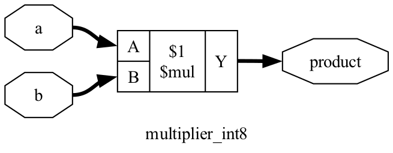

# 🧪 Lab 01: Parameterized Signed Hardware Multiplier (INT8)

In this lab, you will learn how digital hardware multiplies signed binary numbers, write the SystemVerilog RTL, verify it with Python (Cocotb), and inspect how **Yosys** synthesizes it into logic gates.

---

## 📚 1. Hardware Theory & The Math

### Why Signed Multiplication Needs $2\times$ Bit-Width:
* In Two's Complement arithmetic, an 8-bit signed integer (`DATA_WIDTH = 8`) represents numbers from **$-128$ to $+127$**.
* The maximum magnitude product is:
  $$-128 \times -128 = \mathbf{+16,384}$$
* In binary, $+16,384$ requires **15 magnitude bits + 1 sign bit = 16 bits**.
* **Golden Rule of Hardware Arithmetic:** Multiplying two $N$-bit numbers produces up to a **$2N$-bit output**.

```
  Input A (8-bit signed):  [s][b6][b5][b4][b3][b2][b1][b0]  (-128 to +127)
  Input B (8-bit signed):  [s][b6][b5][b4][b3][b2][b1][b0]  (-128 to +127)
                                 │
                                 ▼ (Hardware Multiplier)
  Product (16-bit signed): [s][b14] ... [b1][b0]            (-16,256 to +16,384)
```

---

## 💻 2. SystemVerilog RTL Code (`rtl/multiplier_int8.sv`)

[`rtl/multiplier_int8.sv`](../rtl/multiplier_int8.sv):

```systemverilog
`timescale 1ns/1ps

module multiplier_int8 #(
    parameter int DATA_WIDTH = 8,
    parameter int PROD_WIDTH = 2 * DATA_WIDTH // 16 bits for 8x8
)(
    input  logic signed [DATA_WIDTH-1:0] a,
    input  logic signed [DATA_WIDTH-1:0] b,
    output logic signed [PROD_WIDTH-1:0] product
);

    // Combinational signed multiplication
    assign product = a * b;

endmodule
```

### 🔍 Line-by-Line Explanation:
* **`logic signed [...]`:** Declares signed 2's complement wires. Without `signed`, Verilog treats numbers as unsigned, causing negative multiplication bugs!
* **`parameter int PROD_WIDTH = 2 * DATA_WIDTH`:** Parameterized bit-width so you can reuse this module for INT4, INT8, or INT16.
* **`assign product = a * b;`:** Combinational multiplier operator. In silicon, synthesis tools map this to a **Booth Multiplier** or **Wallace Tree** adder array.

---

## 🧪 3. Python Verification (`labs/test_multiplier.py`)

[`labs/test_multiplier.py`](test_multiplier.py):

```python
import cocotb
from cocotb.triggers import Timer
import random

@cocotb.test()
async def test_multiplier_exhaustive(dut):
    """Test signed corner cases and 200 random vectors vs Python golden math"""
    corner_cases = [
        (0, 0), (0, 127), (0, -128),
        (1, 1), (-1, 1), (-1, -1),
        (127, 127),       # Max pos * Max pos = 16129
        (-128, -128),     # Max neg * Max neg = 16384
        (-128, 127),      # Max neg * Max pos = -16256
        (127, -128),
    ]

    for a, b in corner_cases:
        dut.a.value = a
        dut.b.value = b
        await Timer(1, unit="ns")
        assert int(dut.product.value.to_signed()) == a * b

    for _ in range(200):
        a = random.randint(-128, 127)
        b = random.randint(-128, 127)
        dut.a.value = a
        dut.b.value = b
        await Timer(1, unit="ns")
        assert int(dut.product.value.to_signed()) == a * b
```

### Run the Test:
```bash
python3 labs/run_lab.py --lab lab01
```

---

## 🔬 4. Yosys Logic Synthesis & Gate-Level Schematic

Run synthesis:
```bash
python3 synthesis/synthesize.py --top multiplier_int8
```

### 📊 Gate-Level Cell Breakdown:
* **Total Cells:** 456 logic gates
  * `$_AND_`: 222 gates (partial product generation)
  * `$_XOR_`: 156 gates (full adder sum bits)
  * `$_OR_`: 70 gates (carry propagate)
  * `$_NOT_`: 8 gates (sign bit inversion)

<details>
<summary>🖼️ Click to expand Gate-Level Schematic Diagram</summary>

The generated schematic is stored in [`schematics/multiplier_int8.svg`](../schematics/multiplier_int8.svg):



</details>

---

## 🎯 Key Content & Interview Takeaways
1. **Signed Arithmetic:** Always declare `logic signed` in SystemVerilog; otherwise `$signed(a) * $signed(b)` is required.
2. **Combinational Delay:** An 8-bit multiplier requires multiple adder stages. For high-frequency chips (1 GHz+), multipliers are pipelined with registers.
