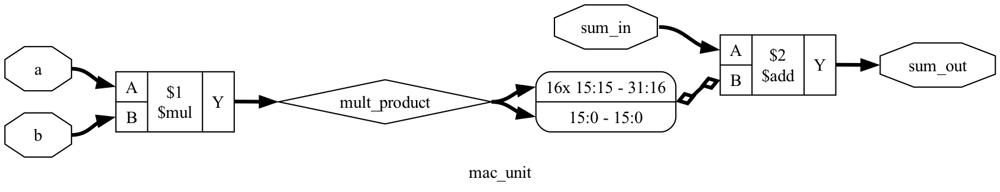

# 🧪 Lab 02: Multiply-Accumulate (MAC) Unit & Sign Extension

The **Multiply-Accumulate (MAC)** unit is the core workhorse of every AI accelerator (Google TPU, NVIDIA Tensor Core, Apple Neural Engine).

In this lab, you will learn how to multiply two 8-bit inputs and safely accumulate them into a **32-bit running total** without overflow or sign corruption.

---

## 📚 1. Hardware Theory: The Accumulator & Sign Extension

### The Math:
$$\text{sum\_out} = \text{sum\_in} + (a \times b)$$

* **Input Operands ($a, b$):** 8-bit signed ($\pm 128$)
* **Product ($a \times b$):** 16-bit signed ($\pm 16,384$)
* **Accumulator (`sum_in` / `sum_out`):** 32-bit signed ($\pm 2.14 \times 10^9$)

### Why Sign Extension Matters:
When adding a 16-bit signed product to a 32-bit accumulator, you cannot just pad with zeros (`0000...`). If the product is negative (e.g. $-50$), padding with zeros turns it into a giant positive number!
* **Solution (Sign Extension):** Replicate the most significant bit (the sign bit) across the upper 16 bits:
  $$\text{Sign-Extended Product} = \{\{16\{\text{product}[15]\}\}, \text{product}\}$$

```
  16-bit Negative Product:                      [ 1 ] [ 111111111001110 ]  (-50)
  32-bit Sign Extended:    [ 1111111111111111 ] [ 1 ] [ 111111111001110 ]  (-50)
                           ▲ (Replicated MSB)
```

---

## 💻 2. SystemVerilog RTL Code (`rtl/mac_unit.sv`)

[`rtl/mac_unit.sv`](../rtl/mac_unit.sv):

```systemverilog
`timescale 1ns/1ps

module mac_unit #(
    parameter int DATA_WIDTH = 8,
    parameter int ACC_WIDTH  = 32
)(
    input  logic signed [DATA_WIDTH-1:0] a,
    input  logic signed [DATA_WIDTH-1:0] b,
    input  logic signed [ACC_WIDTH-1:0]  sum_in,
    output logic signed [ACC_WIDTH-1:0]  sum_out
);

    logic signed [(2*DATA_WIDTH)-1:0] mult_product;

    // 1. Signed multiplication
    assign mult_product = a * b;

    // 2. Sign-extend 16-bit product to 32 bits and add to incoming partial sum
    assign sum_out = sum_in + {{ (ACC_WIDTH - (2*DATA_WIDTH)){mult_product[(2*DATA_WIDTH)-1]} }, mult_product};

endmodule
```

---

## 🧪 3. Python Verification (`labs/test_mac.py`)

[`labs/test_mac.py`](test_mac.py):

```python
import cocotb
from cocotb.triggers import Timer
import random

@cocotb.test()
async def test_mac_exhaustive(dut):
    """Test 200 random MAC combinations: sum_out = sum_in + (a * b)"""
    corner_cases = [
        (0, 0, 0),
        (10, 5, 100),            # 100 + 50 = 150
        (-10, 5, 20),            # 20 - 50 = -30
        (-128, -128, 10000),     # 10000 + 16384 = 26384
        (-128, 127, -500),       # -500 - 16256 = -16756
    ]

    for a, b, s_in in corner_cases:
        dut.a.value = a
        dut.b.value = b
        dut.sum_in.value = s_in
        await Timer(1, unit="ns")
        assert int(dut.sum_out.value.to_signed()) == s_in + (a * b)
```

### Run the Test:
```bash
python3 labs/run_lab.py --lab lab02
```

---

## 🔬 4. Yosys Logic Synthesis & Gate-Level Schematic

Run synthesis:
```bash
python3 synthesis/synthesize.py --top mac_unit
```

### 📊 Gate-Level Cell Breakdown:
* **Total Cells:** 676 logic gates
  * `$_AND_`: 327 gates
  * `$_XOR_`: 219 gates
  * `$_OR_`: 122 gates
  * `$_NOT_`: 8 gates

<details>
<summary>🖼️ Click to expand Gate-Level Schematic Diagram</summary>

The generated schematic is stored in [`schematics/mac_unit.svg`](../schematics/mac_unit.svg):



</details>

---

## 🎯 Key Content & Interview Takeaways
1. **Accumulator Bit Growth:** Why 32-bit accumulators are standard for 8-bit inputs: allows accumulating up to $\mathbf{65,536}$ operations without overflowing!
2. **Replication Operator (`{N{bit}}`):** In SystemVerilog, `{16{sign_bit}}` is the clean, synthesizable way to perform hardware sign extension.
