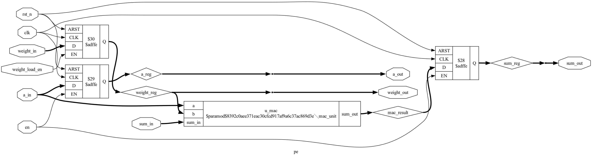

# 🧪 Lab 03: Weight-Stationary Processing Element (PE) & Registers

A **Processing Element (PE)** combines arithmetic logic (MAC) with **sequential Flip-Flop registers** to hold stationary weights, delay activations, and pipe partial sums.

In this lab, you will learn how sequential logic works in SystemVerilog, inspect the **48 D-Flip-Flops** synthesized by **Yosys**, and verify the cell with Python (Cocotb).

---

## 📚 1. Hardware Theory: The Weight-Stationary PE

In Google TPU and modern AI tensor cores, the **Weight-Stationary** architecture minimizes memory power:
1. **Configuration Phase (`weight_load_en = 1`):** A weight is loaded once into the internal `weight_reg` and stays locked in place.
2. **Execution Phase (`en = 1`):**
   * Activations enter from the **LEFT** (`a_in`), get multiplied with the weight, and exit to the **RIGHT** (`a_out`) on the next clock tick.
   * Partial sums enter from the **TOP** (`sum_in`), accumulate $(a \times w)$, and exit to the **BOTTOM** (`sum_out`) on the next clock tick.

```
                     sum_in (32-bit Top input)
                                │
                                ▼
  a_in (8-bit Left) ────► [ MAC Unit ] ────► a_out (8-bit Right registered)
                            ▲      │
                            │      ▼
                      [weight_reg] [sum_reg] (32-bit Bottom registered)
```

---

## 💻 2. SystemVerilog RTL Code (`rtl/pe.sv`)

[`rtl/pe.sv`](../rtl/pe.sv):

```systemverilog
`timescale 1ns/1ps

module pe #(
    parameter int DATA_WIDTH = 8,
    parameter int ACC_WIDTH  = 32
)(
    input  logic                         clk,
    input  logic                         rst_n,
    input  logic                         en,
    input  logic                         weight_load_en,
    
    input  logic signed [DATA_WIDTH-1:0] weight_in,
    output logic signed [DATA_WIDTH-1:0] weight_out,
    
    input  logic signed [DATA_WIDTH-1:0] a_in,
    output logic signed [DATA_WIDTH-1:0] a_out,
    
    input  logic signed [ACC_WIDTH-1:0]  sum_in,
    output logic signed [ACC_WIDTH-1:0]  sum_out
);

    // Internal Sequential Flip-Flop Registers (48 bits total)
    logic signed [DATA_WIDTH-1:0] weight_reg; // 8 bits
    logic signed [DATA_WIDTH-1:0] a_reg;      // 8 bits
    logic signed [ACC_WIDTH-1:0]  sum_reg;    // 32 bits

    logic signed [ACC_WIDTH-1:0] mac_result;

    // Combinational MAC Unit Instance
    mac_unit #(.DATA_WIDTH(DATA_WIDTH), .ACC_WIDTH(ACC_WIDTH)) u_mac (
        .a(a_in), .b(weight_reg), .sum_in(sum_in), .sum_out(mac_result)
    );

    // Sequential Clocked Process (Rising edge flip-flops)
    always_ff @(posedge clk or negedge rst_n) begin
        if (!rst_n) begin
            weight_reg <= '0;
            a_reg      <= '0;
            sum_reg    <= '0;
        end else begin
            if (weight_load_en) weight_reg <= weight_in;
            if (en) begin
                a_reg   <= a_in;
                sum_reg <= mac_result;
            end
        end
    end

    assign a_out      = a_reg;
    assign sum_out    = sum_reg;
    assign weight_out = weight_reg;

endmodule
```

---

## 🧪 3. Python Verification (`tests/test_pe.py`)

[`tests/test_pe.py`](../tests/test_pe.py):

```python
import cocotb
from cocotb.clock import Clock
from cocotb.triggers import RisingEdge, Timer

@cocotb.test()
async def test_pe_basic_mac(dut):
    """Test weight load, clock pulsing, and sequential register latching"""
    clock = Clock(dut.clk, 10, unit="ns")
    cocotb.start_soon(clock.start())

    # 1. Reset
    dut.rst_n.value = 0
    await RisingEdge(dut.clk)
    dut.rst_n.value = 1
    await RisingEdge(dut.clk)

    # 2. Load Weight W = 7
    dut.weight_load_en.value = 1
    dut.weight_in.value = 7
    await RisingEdge(dut.clk)
    dut.weight_load_en.value = 0

    # 3. Compute with A = 6, sum_in = 100
    dut.en.value = 1
    dut.a_in.value = 6
    dut.sum_in.value = 100
    await RisingEdge(dut.clk)
    await Timer(1, unit="ns")

    # Expected: sum_out = 100 + (6 * 7) = 142
    assert int(dut.sum_out.value.to_signed()) == 142
    assert int(dut.a_out.value.to_signed()) == 6
```

### Run the Test:
```bash
python3 labs/run_lab.py --lab lab03
```

---

## 🔬 4. Yosys Logic Synthesis & Register Extraction

Run synthesis:
```bash
python3 synthesis/synthesize.py --top pe
```

### 📊 Register & Gate Breakdown:
* **Flip-Flop Cells:** Exactly **48 D-Flip-Flops (`$_DFFE_PN0P_`)**:
  * $8\text{ bits}$ (`weight_reg`) + $8\text{ bits}$ (`a_reg`) + $32\text{ bits}$ (`sum_reg`) = **48 FFs**
* **Combinational Cells:** 676 logic gates (inside `mac_unit`)
* **Total Module Area:** 724 cells

<details>
<summary>🖼️ Click to expand Processing Element Schematic Diagram</summary>

The generated schematic is stored in [`schematics/pe.svg`](../schematics/pe.svg):



</details>

---

## 🎯 Key Content & Interview Takeaways
1. **Clock Domain & Setup/Hold Timing:** The outputs of the PE are registered, meaning timing paths are localized to single clock cycles between adjacent PEs.
2. **Why Weight-Stationary Saves Power:** Moving data across global buses consumes 100x more energy than computing. Locking weights in local PE registers drastically cuts off-chip memory traffic.
