# 🔬 Lab 00: Parameterized Signed Adder & Saturation Arithmetic
### Foundations of Fixed-Point Digital Arithmetic & Numerical Stability in AI Silicon

* **Track:** Silicon Arithmetic & Math Engines
* **RTL:** [`rtl/adder.sv`](../../rtl/adder.sv)
* **Testbench:** [`labs/test_adder.py`](../test_adder.py)

---

## 1. Educational Importance: Why Fixed-Point Precision Matters in AI Accelerators

In modern digital hardware and domain-specific AI accelerators (e.g., Google TPU, NVIDIA Tensor Cores, and edge NPUs), compute density and power efficiency demand fixed-point integer arithmetic (INT8, INT16) over costly 32-bit floating-point units.

### The Arithmetic Challenge in Hardware
* **Fixed-Width Dynamic Range:** An 8-bit signed two's complement integer can only represent numbers in the closed range $[-128, +127]$.
* **Standard Wrap-Around Arithmetic:** When adding two large positive activations ($+100 + +50 = +150$), standard addition overflows and wraps around to **$-106$** due to sign-bit corruption.
* **Impact on Neural Networks:** In neural network inference and gradient accumulation, a strong positive activation turning into an extreme negative value degrades prediction accuracy and causes numerical instability.
* **The Engineering Solution (Saturation Arithmetic):** Hardware-level saturation detects boundary violations and clamps the result to representable bounds ($+127$ for positive overflow, $-128$ for negative overflow), preserving monotonic activation behavior.

---

## 2. Bit-Level Hardware Intuition: Full Adder, Carry & Overflow

To understand how silicon computes arithmetic, we analyze signals down to individual logic gates and bit slices.

---

### A. The 1-Bit Full Adder: Anatomy & Gate Logic

Every addition at bit position $k$ takes **3 inputs** and produces **2 outputs**:
* **Inputs:** Operand Bit $A$, Operand Bit $B$, and incoming Carry $C_{in}$ (propagated from the lower significant bit).
* **Outputs:** Local Result $\text{Sum}$ ($S$) and Carry-out ($C_{out}$).

```
                     ┌────────────────────────┐
   A  ──────────────►│                        │──────────────► Sum (S) = A ⊕ B ⊕ Cin
   B  ──────────────►│   1-Bit Full Adder     │
  Cin ──────────────►│                        │──────────────► Cout = (A·B) + Cin·(A ⊕ B)
                     └────────────────────────┘
```

#### 🔍 Gate Logic Derivation:
1. **$\text{Sum} = A \oplus B \oplus C_{in}$ (Parity / Odd-1s Detector):**
   * $\text{XOR}$ evaluates to `1` if and only if an **odd number of inputs** are `1` ($1$ or $3$ active high inputs).
   * When two inputs are `1`, their binary sum is $1+1 = 2_{10} = 10_2$. The local bit ($\text{Sum}$) is `0`, and a carry is generated to the next position.
2. **$C_{out} = (A \cdot B) + (C_{in} \cdot (A \oplus B))$ (Majority Function):**
   * A carry is produced whenever **2 or more inputs** are `1`. If $\sum \ge 2_{10}$, the output requires a carry bit into the next power-of-two position.

#### 📊 Complete Full Adder Truth Table

| $A$ | $B$ | $C_{in}$ | Decimal Total | Binary ($C_{out} \ S$) | $\text{Sum} \ (S)$ | $C_{out}$ | Bit-Level Meaning |
| :---: | :---: | :---: | :---: | :---: | :---: | :---: | :--- |
| `0` | `0` | `0` | $0$ | `0 0` | **0** | **0** | Zero addition |
| `0` | `0` | `1` | $1$ | `0 1` | **1** | **0** | Single `1` $\rightarrow$ Sum = 1 |
| `0` | `1` | `0` | $1$ | `0 1` | **1** | **0** | Single `1` $\rightarrow$ Sum = 1 |
| `0` | `1` | `1` | $2$ | `1 0` | **0** | **1** | $1+1=2 \rightarrow$ Sum = 0, Carry = 1 |
| `1` | `0` | `0` | $1$ | `0 1` | **1** | **0** | Single `1` $\rightarrow$ Sum = 1 |
| `1` | `0` | `1` | $2$ | `1 0` | **0** | **1** | $1+1=2 \rightarrow$ Sum = 0, Carry = 1 |
| `1` | `1` | `0` | $2$ | `1 0` | **0** | **1** | $1+1=2 \rightarrow$ Sum = 0, Carry = 1 |
| `1` | `1` | `1` | $3$ | `1 1` | **1** | **1** | $1+1+1=3 \rightarrow$ Sum = 1, Carry = 1 |

#### 🛠️ Gate-Level Schematic

```
        A ──────┬───────────────┐
                │               │
        B ──────┼───────┐       │
                │       │       │
              ┌─▼───────▼─┐     │     ┌─────────┐
              │   XOR 1   ├─────┼────►│  XOR 2  ├─────────────► Sum (S)
              └───┬───────┘     │  ┌─►└──▲──────┘
                  │             │  │     │
                  │             └─-┼─────┼────────┐
                  │                │     │        │
     Cin ─────────┼────────────────┴─────┘        │
                  │                               │
                  │            ┌─────────┐        │
                  ├───────────►│  AND 1  ├─────┐  │
                  │            └──▲──────┘     │  │
                  │               │            ▼──▼──┐
                  │               │            │ OR  ├────────► Cout
                  │               │            ▲──▲──┘
                  │   ┌─────────┐ │            │
                  └──►│  AND 2  ├─┘            │
                      └──▲───▲──┘              │
                         │   │                 │
                         └───┴─────────────────┘
```

---

### B. Cascading Bit Slices: The Ripple-Carry Adder Architecture

In an $N$-bit adder, individual 1-bit full adder cells are chained in sequence. Each bit slice propagates its $C_{out}$ to the adjacent more-significant bit's $C_{in}$:

```
       A[3] B[3]         A[2] B[2]         A[1] B[1]         A[0] B[0]
         │   │             │   │             │   │             │   │
       ┌─▼───▼─┐         ┌─▼───▼─┐         ┌─▼───▼─┐         ┌─▼───▼─┐
Cout ◄─┤ FA 3  │◄──C[2]──┤ FA 2  │◄──C[1]──┤ FA 1  │◄──C[0]──┤ FA 0  │◄── Cin = 0
       └───┬───┘         └───┬───┘         └───┬───┘         └───┬───┘
           ▼                 ▼                 ▼                 ▼
        Sum[3]            Sum[2]            Sum[1]            Sum[0]
```

* **Gate Complexity:** $O(N)$ Linear ($\approx 5$ logic gates per bit $\times N$ bits $\approx 40$ gates for INT8).
* **Propagation Delay Analysis:** The carry signal ripples through all $N$ stages ($C_0 \to C_1 \to \dots \to C_{N-1}$), defining the combinational critical path. High-speed processor designs utilize Carry-Lookahead or Parallel-Prefix (Kogge-Stone) trees to reduce latency from $O(N)$ to $O(\log N)$.

---

### C. Distinguishing Unsigned Carry vs. Signed Overflow

In hardware engineering, **Carry** and **Overflow** represent two distinct boundary conditions:

```
┌─────────────────────────────────────────────────────────────────────────────┐
│ 1. CARRY (Unsigned Addition)                                                │
│    Occurs when the sum exceeds the maximum unsigned range [0, 2^N - 1].     │
│    Hardware Indicator: Carry-out from the Most Significant Bit (MSB).       │
│                                                                             │
│ 2. OVERFLOW (Signed Two's Complement)                                       │
│    Occurs when the sum exceeds the signed dynamic range [-2^(N-1), 2^(N-1)-1]│
│    Hardware Indicator: (A[MSB] == B[MSB]) && (Sum[MSB] != A[MSB]).          │
└─────────────────────────────────────────────────────────────────────────────┘
```

#### 🚨 Two's Complement Signed Overflow Mechanics
In 8-bit signed representation ($[-128, +127]$), the MSB (Bit 7) denotes sign (`0` = Positive, `1` = Negative).

1. **Positive Overflow ($+ \text{ and } + = -$):**
   ```
     +100  (8'b0110_0100)  [Sign bit = 0]
   +  +50  (8'b0011_0010)  [Sign bit = 0]
   ──────────────────────
     -106  (8'b1001_0110)  ◄── Result wrapped into negative representation!
   ```
2. **Negative Overflow ($- \text{ and } - = +$):**
   ```
     -100  (8'b1001_1100)  [Sign bit = 1]
   +  -50  (8'b1100_1110)  [Sign bit = 1]
   ──────────────────────
     +106  (8'b0110_1010)  ◄── Result wrapped into positive representation!
   ```
3. **Opposite Sign Operands ($+ \text{ and } -$):**
   * **Never causes overflow**, because adding opposite signs produces a result strictly bounded by $\max(|A|, |B|)$.

---

### D. Formal Mathematical Proof: Two's Complement Overflow Identity ($V = C_{N-1} \oplus C_N$)

**Theorem:** In an $N$-bit signed two's complement adder, arithmetic overflow $V$ occurs if and only if the carry-in into the most significant bit ($C_{N-1}$) differs from the carry-out from the most significant bit ($C_N$):
$$V = C_{N-1} \oplus C_N$$

#### Proof:
Let $a, b$ be two $N$-bit signed two's complement numbers with bit-level values:
$$a = -a_{N-1} 2^{N-1} + \sum_{i=0}^{N-2} a_i 2^i, \quad b = -b_{N-1} 2^{N-1} + \sum_{i=0}^{N-2} b_i 2^i$$
where $a_{N-1}, b_{N-1} \in \{0, 1\}$ are the sign bits.

At the most significant bit slice (bit $N-1$), the full adder inputs are $a_{N-1}$, $b_{N-1}$, and the incoming carry $C_{N-1}$ from bit slice $N-2$. The full adder outputs are:
$$S_{N-1} = a_{N-1} \oplus b_{N-1} \oplus C_{N-1}$$
$$C_N = a_{N-1} b_{N-1} + C_{N-1}(a_{N-1} \oplus b_{N-1})$$

By definition, signed overflow occurs when two non-negative numbers produce a negative sum ($a_{N-1}=0, b_{N-1}=0, S_{N-1}=1$) OR two negative numbers produce a non-negative sum ($a_{N-1}=1, b_{N-1}=1, S_{N-1}=0$):
$$V = \overline{a_{N-1}} \cdot \overline{b_{N-1}} \cdot S_{N-1} + a_{N-1} \cdot b_{N-1} \cdot \overline{S_{N-1}}$$

We evaluate $V$ and the XOR expression $C_{N-1} \oplus C_N$ by partitioning into exhaustive operand cases:

1. **Case 1: $a_{N-1} = 0, b_{N-1} = 0$ (Two Positive Operands)**
   - Carry-out:
     $$C_N = (0 \cdot 0) + C_{N-1}(0 \oplus 0) = 0$$
   - Sum bit:
     $$S_{N-1} = 0 \oplus 0 \oplus C_{N-1} = C_{N-1}$$
   - Overflow definition:
     $$V = (\overline{0} \cdot \overline{0} \cdot C_{N-1}) + (0 \cdot 0 \cdot \overline{C_{N-1}}) = 1 \cdot 1 \cdot C_{N-1} + 0 = C_{N-1}$$
   - Carry XOR term:
     $$C_{N-1} \oplus C_N = C_{N-1} \oplus 0 = C_{N-1}$$
   - Hence, $V = C_{N-1} \oplus C_N$.

2. **Case 2: $a_{N-1} = 1, b_{N-1} = 1$ (Two Negative Operands)**
   - Carry-out:
     $$C_N = (1 \cdot 1) + C_{N-1}(1 \oplus 1) = 1 + C_{N-1}(0) = 1$$
   - Sum bit:
     $$S_{N-1} = 1 \oplus 1 \oplus C_{N-1} = 0 \oplus C_{N-1} = C_{N-1}$$
   - Overflow definition:
     $$V = (\overline{1} \cdot \overline{1} \cdot C_{N-1}) + (1 \cdot 1 \cdot \overline{C_{N-1}}) = 0 + 1 \cdot 1 \cdot \overline{C_{N-1}} = \overline{C_{N-1}}$$
   - Carry XOR term:
     $$C_{N-1} \oplus C_N = C_{N-1} \oplus 1 = \overline{C_{N-1}}$$
   - Hence, $V = C_{N-1} \oplus C_N$.

3. **Case 3: $a_{N-1} \ne b_{N-1}$ (Opposite Sign Operands)**
   - Adding a positive number and a negative number cannot exceed the range $[-2^{N-1}, 2^{N-1}-1]$, so $V = 0$.
   - In hardware:
     $$C_N = (a_{N-1} \cdot b_{N-1}) + C_{N-1}(a_{N-1} \oplus b_{N-1}) = 0 + C_{N-1}(1) = C_{N-1}$$
   - Therefore:
     $$C_{N-1} \oplus C_N = C_{N-1} \oplus C_{N-1} = 0 = V$$

**Conclusion (Q.E.D.):** For all possible inputs:
$$V = C_{N-1} \oplus C_N$$
In hardware synthesis, this identity means overflow detection requires merely a single 2-input XOR gate tapping the carry lines of the MSB slice, completely bypassing complex operand-and-sum sign comparison trees!

---

## 3. SystemVerilog RTL Architecture ([`rtl/adder.sv`](../../rtl/adder.sv))

```systemverilog
module adder #(
    parameter int DATA_WIDTH = 8
)(
    input  logic signed [DATA_WIDTH-1:0] a,
    input  logic signed [DATA_WIDTH-1:0] b,
    input  logic                         saturate,
    output logic signed [DATA_WIDTH-1:0] sum,
    output logic                         carry_out,
    output logic                         overflow
);

    logic signed [DATA_WIDTH:0] raw_sum;
    localparam logic signed [DATA_WIDTH-1:0] MAX_POS = {1'b0, {(DATA_WIDTH-1){1'b1}}}; // +127 for INT8
    localparam logic signed [DATA_WIDTH-1:0] MAX_NEG = {1'b1, {(DATA_WIDTH-1){1'b0}}}; // -128 for INT8

    always_comb begin
        // 1. Bit-extension preserves full precision for status extraction
        raw_sum = {a[DATA_WIDTH-1], a} + {b[DATA_WIDTH-1], b};

        // 2. Unsigned carry-out from MSB extension
        carry_out = raw_sum[DATA_WIDTH];

        // 3. Signed overflow detection (matching operand signs producing conflicting sum sign)
        overflow = (a[DATA_WIDTH-1] == b[DATA_WIDTH-1]) && 
                   (raw_sum[DATA_WIDTH-1] != a[DATA_WIDTH-1]);

        // 4. Programmable saturation clamping
        if (saturate && overflow) begin
            sum = (a[DATA_WIDTH-1] == 1'b0) ? MAX_POS : MAX_NEG;
        end else begin
            sum = raw_sum[DATA_WIDTH-1:0];
        end
    end

endmodule
```

### 📐 Logic Synthesis & Hardware Schematic



> [!NOTE]
> **Synthesis & Complexity Analysis:**
> * **Sequential Registers (DFF):** `0 DFFs` (Pure Combinational Circuit)
> * **Gate Complexity:** $O(N)$ Linear ($\approx 42$ Logic Gates: 16 XORs, 16 ANDs, 8 ORs, Saturation MUX)
> * **Latency & Propagation Delay:** $0\text{ Clock Cycles}$ ($\approx 1.2\text{ ns}$ Combinational Ripple Path)
> * **Arithmetic Format:** INT8 Signed Two's Complement with Boundary Clamping ($[-128, +127]$)
> * **Interactive Controls:** Open [`schematics/adder.svg`](../../schematics/adder.svg) in your browser to interactively probe ports, expand internal full adder slices, and highlight signal nets.

---

## 4. Adder Microarchitectures: Critical Path & Silicon Area Trade-off Matrix

When designing hardware for AI accelerators, choosing an adder topology involves a fundamental trade-off between silicon area (cost/power) and propagation delay ($F_{max}$).

### Critical Path & Area Trade-Off Matrix
$$\begin{array}{|l|c|c|c|c|c|}
\hline
\textbf{Adder Architecture} & \textbf{Delay Complexity} & \textbf{Area Complexity} & \textbf{Fan-Out} & \textbf{Wiring Congestion} & \textbf{Typical Application} \\
\hline
\text{Ripple-Carry Adder (RCA)} & O(N) & O(N) & 1\text{ (Minimal)} & \text{Very Low (Planar)} & \text{Edge NPUs, PE MAC Local Adders} \\
\text{Carry-Skip Adder (CSK)} & O(\sqrt{N}) & O(N) & 2\text{--}3 & \text{Low} & \text{Low-Power Embedded DSPs} \\
\text{Carry-Lookahead Adder (CLA)} & O(\log N) & O(N \log N) & \text{High } (O(N)) & \text{Medium} & \text{ALU Datapaths (16/32-bit)} \\
\text{Brent-Kung Parallel-Prefix} & O(2 \log_2 N - 2) & O(N) & 2\text{ (Bounded)} & \text{Low} & \text{High-Speed 64-bit ALUs} \\
\text{Kogge-Stone Parallel-Prefix} & O(\log_2 N) & O(N \log_2 N) & 2\text{ (Minimal)} & \text{Very High (Dense Tracks)} & \text{Ultra-High-Freq Host ALUs (3+ GHz)} \\
\text{Carry-Save Adder (CSA Tree)} & O(1) & O(N) & 1 & \text{Very Low} & \text{Systolic MACs \& Tensor Core Trees} \\
\hline
\end{array}$$

#### Analytical Propagation Delay Comparison:
* **Ripple-Carry (RCA):**
  $$t_{RCA} = (N - 1) t_{carry\_prop} + t_{sum\_gen}$$
  For $N=8$, delay is $\approx 7 \times 120\text{ ps} + 150\text{ ps} \approx 990\text{ ps}$. Simple, small, and perfectly adequate inside single PE MAC units where cycle times are $\ge 2\text{ ns}$.
* **Carry-Lookahead (CLA):**
  Generates carries in parallel via Generate ($G_i = A_i \cdot B_i$) and Propagate ($P_i = A_i \oplus B_i$):
  $$C_{i+1} = G_i + P_i C_i = G_i + P_i G_{i-1} + P_i P_{i-1} G_{i-2} + \dots$$
  Reduces delay to $O(\log N)$ at the expense of high gate fan-in and silicon area overhead.
* **Kogge-Stone Prefix Tree:**
  Computes prefix carries in $\log_2(N)$ stages using prefix operator cells $(G, P) \circ (G', P') = (G + P \cdot G', P \cdot P')$. For 32-bit accumulators, Kogge-Stone evaluates in just 5 gate levels, but wiring density creates routing congestion in dense silicon floorplans.

---

## 5. Saturation Mechanics in Quantized LLM Datapaths

Why do production AI accelerators insist on hardware saturation rather than native modular wrap-around?

### The "Catastrophic Sign Inversion" Problem in LLMs
Modern Large Language Models (LLaMA 3, Gemma, Mistral) feature emergent **outlier features**—rare activation channels whose magnitudes exceed normal values by $10\times$ to $100\times$:
1. **With Wrap-Around ($100 + 50 = -106$):**
   * A strongly positive attention activation ($+100$) intended to trigger high attention probability wraps around into a large negative number ($-106$).
   * In Softmax: $e^{-106} \approx 0.0$, completely suppressing the intended attention head!
   * The sign flip turns an excitatory neuron into a heavy inhibitory neuron, destroying model perplexity and generating gibberish tokens.
2. **With Hardware Saturation ($100 + 50 \to +127$):**
   * Clamping enforces the monotonic invariant:
     $$x_1 > x_2 \implies \text{clamp}(x_1) \ge \text{clamp}(x_2)$$
   * Outliers are slightly compressed, but their positive polarity and relative significance are strictly preserved, allowing quantized INT8 models to match FP16 accuracy.

---

## 6. Real-World Accelerator Mapping: Google TPU & NVIDIA Tensor Cores

### Google TPU v1 256x256 Matrix Multiply Unit (MXU)
* The TPU v1 MXU contains $65,536$ MAC units computing INT8 matrix multiplication.
* Each column of 256 PEs culminates in a **32-bit Accumulator Unit** equipped with programmable hardware saturation.
* Activations flow horizontally, partial sums accumulate vertically down the column, and final saturation clamps the accumulated results before writing back to the 24MB Unified Buffer.

### NVIDIA Tensor Core Accumulator Trees (Ampere & Hopper)
* Inside each SM (Streaming Multiprocessor), NVIDIA Tensor Cores execute fused matrix operations (e.g., `mma.sync.aligned.m16n8k32.row.col`).
* Multiplication of INT8 inputs produces 16-bit intermediate products that are compressed via a multi-operand **Carry-Save Adder (CSA) tree** (Wallace reduction) without propagating carries.
* Only at the root of the tree does a single high-speed adder resolve the sum and carry vectors into a final 32-bit signed accumulator with optional saturation clamping.

---

## 7. Verification & Testing with Cocotb

The module is verified against a golden Python reference model using Cocotb.

* **Key Corner Cases Verified:**
  1. Identity and zero addition ($0 + 0 = 0$, $X + 0 = X$)
  2. Dynamic range boundaries ($-128 + 0$, $+127 + 0$)
  3. Positive saturation clamping ($+100 + +50 \to +127$)
  4. Negative saturation clamping ($-100 + -50 \to -128$)
  5. Non-saturating wrap-around verification

To execute the testbench:
```bash
python labs/run_lab.py --lab lab00
```

---

## 8. Review & Engineering Analysis Questions

1. **Gate Trade-offs:** How does the critical path delay of an $N$-bit Ripple-Carry Adder compare to a Carry-Lookahead Adder (CLA), and what is the associated silicon area overhead?
2. **Alternative Overflow Formula:** Prove mathematically that signed overflow in two's complement can also be computed as $\text{overflow} = C_{in(\text{MSB})} \oplus C_{out(\text{MSB})}$.
3. **Hardware Saturation in Quantized AI:** Why is saturation arithmetic preferred over modular wrap-around when executing low-bitwidth integer matrix multiplication in Transformer inference?

---

## 🗺️ Curriculum Progression Map

| Lab | Hardware Module | Architectural Purpose |
| :--- | :--- | :--- |
| **Lab 00** | Parameterized Signed Adder | Fundamental arithmetic & saturation handling |
| **Lab 01** | Signed INT8 Multiplier | $O(N^2)$ gate scaling & partial product generation |
| **Lab 02** | Multiply-Accumulate (MAC) Unit | Fused core arithmetic for tensor dot products |
| **Lab 03** | Processing Element (PE) | Register staging & weight-stationary storage |
| **Lab 04** | 2D Systolic Array | Spatial matrix multiplication engine (TPU-style) |
| **Lab 05–08** | Transformer SFUs | Specialized functional units for attention normalization & nonlinearities |
