# 🔬 Lab 01: Parameterized Signed Multiplier (INT8)
### Wallace Trees, Two's Complement Sign Extensions & Bit-Growth Dynamics

* **Track:** Silicon Arithmetic & Math Engines
* **RTL:** [`rtl/multiplier_int8.sv`](../../rtl/multiplier_int8.sv)
* **Testbench:** [`labs/test_multiplier.py`](../test_multiplier.py)

---

## 1. Educational & Architectural Importance

Matrix multiplication ($Y = W \cdot X$) accounts for over 90% of total arithmetic operations in Deep Learning workloads.

* **Complexity Scaling ($O(N)$ vs $O(N^2)$):** While an adder scales linearly in logic gates, a multiplier scales quadratically with bit-width ($\approx 456$ gates for INT8 vs $\approx 1800+$ for INT16). 
* **The Power of Quantization:** Reducing weights from 16-bit to 8-bit cuts multiplier silicon area and energy by **$4\times$ ($2^2$)**, allowing modern AI chips to pack thousands of compute engines onto a single die.

---

## 2. Hardware Intuition: How Silicon Multiplies

### A. The Shift-and-Add Algorithm (Pen & Paper)
In digital hardware, binary multiplication is simply a series of **AND gates (multiplication by 0 or 1)** and **adders with bit-shifts**:

```
        0 1 1 0   (6 in decimal)   [Operand A]
      x 0 0 1 1   (3 in decimal)   [Operand B]
      ─────────
        0 1 1 0   (A * Bit 0: Shift 0)
    + 0 1 1 0     (A * Bit 1: Shift 1)
    + 0 0 0 0     (A * Bit 2: Shift 2)
    + 0 0 0 0     (A * Bit 3: Shift 3)
  ─────────────
    0 0 1 0 0 1 0 (18 in decimal)  [Product: 8 bits wide]
```

### B. The Signed Two's Complement Trap
Beginners often assume you can pass two's complement numbers into a naive unsigned multiplier. **This causes severe bugs:**

* Suppose $A = -2$ (`4'b1110` in 4-bit two's complement) and $B = 3$ (`4'b0011`).
* **Unsigned Multiplier Interpretation:** Treats `1110` as $+14_{10}$.
  $$14 \times 3 = 42_{10} \quad (\text{Wrong! Expected } -6)$$
* **The Hardware Fix:** Declaring signals as `logic signed` in SystemVerilog instructs the synthesis tool to insert signed arithmetic tree compressors (Baugh-Wooley / Booth encoding) that properly account for negative sign weights!

### C. Bit Growth Proof: Why Output Width $= W_A + W_B$
* Maximum Positive: $+127 \times +127 = +16,129$ (Fits in 15 bits: `15'b011111100000001`)
* Maximum Negative: $-128 \times +127 = -16,256$ (Fits in 15 bits)
* **The Asymmetric Corner Case:** $-128 \times -128 = \mathbf{+16,384}$ (`16'b0100000000000000`).
  * In two's complement, $+16,384$ strictly requires **16 bits** (15 magnitude bits + 1 sign bit). Truncating to 15 bits would flip $+16,384$ into a negative number!

---

## 3. SystemVerilog RTL Architecture

```systemverilog
module multiplier_int8 #(
    parameter int A_WIDTH = 8,
    parameter int B_WIDTH = 8,
    localparam int PROD_WIDTH = A_WIDTH + B_WIDTH
)(
    input  logic signed [A_WIDTH-1:0]    a,
    input  logic signed [B_WIDTH-1:0]    b,
    output logic signed [PROD_WIDTH-1:0] product
);
    // Explicit signed multiplication datapath
    assign product = a * b;
endmodule
```

### 📐 Logic Synthesis & Hardware Schematic



> [!NOTE]
> **Synthesis & Complexity Analysis:**
> * **Sequential Registers (DFF):** `0 DFFs` (Pure Combinational Datapath)
> * **Gate Complexity:** $O(N^2)$ Quadratic Scaling ($\approx 456$ Logic Gates: 64 AND Partial Products, Radix-4 Booth, CSA Wallace Tree, 16-Bit CPA)
> * **Latency & Propagation Delay:** $0\text{ Clock Cycles}$ ($\approx 2.8\text{ ns}$ CSA Tree Critical Path)
> * **Dynamic Bit Growth:** 8-bit $\times$ 8-bit $\to$ 16-bit Product ($[-16,256 \dots +16,384]$)
> * **Interactive Controls:** Open [`schematics/multiplier_int8.svg`](../../schematics/multiplier_int8.svg) in your browser to interactively expand the 4 internal functional stages (Booth Encoder, PP Generator, CSA Reduction Tree, and Final CPA).

---

## 4. Verification & Testing with Cocotb

The module is verified against Python signed integer multiplication.

* **Corner Cases Verified:**
  * Zero multiplication ($0 \times 127 = 0$)
  * Maximum negative product ($-128 \times +127 = -16256$)
  * Asymmetric two's complement boundary ($-128 \times -128 = +16384$)
  * Identity scaling ($-45 \times 1 = -45$)

To execute the testbench:
```bash
python labs/run_lab.py --lab lab01
```

---

## 5. Review & Engineering Analysis Questions

1. **Bit Growth Proof:** Why does multiplying an $N$-bit signed integer by an $M$-bit signed integer strictly require $(N+M)$ bits to represent all possible outputs without overflow?
2. **Two's Complement Asymmetry:** Explain why the single combination $-128 \times -128 = +16384$ requires the 16th bit, whereas all positive products fit in 15 bits.
3. **Silicon Area vs Precision:** Why does transitioning from INT16 to INT8 quantization reduce multiplier silicon area by approximately $4\times$?
