# 🧪 Lab 02: Multiply-Accumulate (MAC) Unit
### Accumulator Headroom Induction Proofs, Sign Extension & Pipelined Timing Dynamics

* **Track:** Silicon Arithmetic & Math Engines
* **RTL:** [`rtl/mac_unit.sv`](../../rtl/mac_unit.sv)
* **Testbench:** [`labs/test_mac.py`](../test_mac.py)
* **Next Lab:** [Lab 03: Weight-Stationary Processing Element](lab03_processing_element_slides.md)

---

## 1. Educational & Architectural Importance

The Multiply-Accumulate (MAC) operation:
$$\text{Accumulator} \leftarrow \text{Accumulator} + (A \times B)$$
forms the core arithmetic primitive of modern Deep Learning workloads, powering matrix multiplications, convolutions, and Transformer multi-head attention projections.

```
       Operand A (8-bit) ──┐
                           ├──► [ 8x8 Multiplier ]
       Operand B (8-bit) ──┘           │
                                       ▼ (16-bit Product)
                             [ Sign-Extension (16b ➔ 32b) ]
                                       │
                                       ▼ (32-bit Extended Product)
      sum_in (32-bit) ───────────────► [+] (32-bit Adder)
                                       │
                                       ▼
                                sum_out (32-bit)
```

In AI accelerators, the MAC unit executes continuously across thousands of clock cycles. Designing its datapath requires rigorous mathematical precision: allocating enough accumulator headroom to guarantee zero overflow during deep inner-product reductions without wasting valuable flip-flop and adder silicon area.

---

## 2. Formal Mathematical Headroom Proof: 32-Bit Accumulator Dynamic Range

### Theorem (32-Bit Accumulator Zero-Overflow Invariant)
Let $a_k, b_k \in [-128, +127]$ be $K$ consecutive signed INT8 operands. When summing their products into an `INT32` two's complement accumulator initialized to $0$:
$$S_K = \sum_{k=1}^K (a_k \cdot b_k)$$
the accumulator is mathematically guaranteed never to overflow for all reduction lengths:
$$K \le 131,072$$

---

### Step-by-Step Proof by Induction:

#### Step 1: Bounding Single-Term Product Dynamic Range
For any INT8 inputs $a_k, b_k \in [-128, +127]$:
1. **Upper Bound:**
   The maximum positive product occurs at $(-128) \times (-128)$:
   $$P_{max} = (-128) \times (-128) = +16,384 = 2^{14}$$
   *(Note: For positive inputs, $\max(+127 \times +127) = +16,129 < 16,384$)*.
2. **Lower Bound:**
   The maximum negative product occurs at $(-128) \times (+127)$:
   $$P_{min} = (-128) \times (+127) = -16,256$$

#### Step 2: Bounding $K$-Term Reduction Sum
For $K$ terms, the maximum possible positive and negative accumulated values are:
$$S_K^{max} = \sum_{k=1}^K P_{max} = K \cdot 16,384 = K \cdot 2^{14}$$
$$S_K^{min} = \sum_{k=1}^K P_{min} = K \cdot (-16,256)$$

#### Step 3: Determining Upper Limit $K$ for INT32
An `INT32` signed two's complement accumulator has dynamic range:
$$\text{Range}(\text{INT32}) = \left[ -2^{31}, \ 2^{31} - 1 \right] = \left[ -2,147,483,648, \ +2,147,483,647 \right]$$

To guarantee no positive overflow:
$$K \cdot 2^{14} \le 2^{31} - 1$$
$$K \le \frac{2^{31} - 1}{2^{14}} = 2^{17} - \frac{1}{2^{14}} = 131,072 - \frac{1}{16,384}$$
Since $K$ must be an integer:
$$K_{max} = 131,072$$

To guarantee no negative overflow:
$$|S_K^{min}| = K \cdot 16,256 \le 2^{31} \implies K \le \frac{2,147,483,648}{16,256} \approx 132,104.06$$

The global limiting constraint is positive accumulation:
$$K \le 131,072 \quad \text{(Q.E.D.)}$$

---

### Comparison: Why an INT16 Accumulator Fails Catastrophically
Suppose an accelerator attempted to conserve silicon by using an `INT16` accumulator (Range: $[-32,768, +32,767]$):
* **At $K = 1$:** $P_1 = +16,384 \le 32,767$ (Valid).
* **At $K = 2$:** $S_2 = 16,384 + 16,384 = 32,768 > 32,767$ $\implies$ **OVERFLOW on Term 2!**
* **Negative Direction ($P_k = -16,256$):**
  * Term 1: $-16,256$
  * Term 2: $-32,512$
  * Term 3: $-48,768 < -32,768 \implies$ **OVERFLOW on Term 3!**

An INT16 accumulator overflows after only $2$ or $3$ additions, rendering it useless for matrix multiplication.

#### Safety Margin in Production LLMs
In contemporary Large Language Models (e.g., LLaMA 3 70B, GPT-4, Mistral Large):
* Hidden dimension $d_{model} \in \{4096, 8192, 12288\}$
* Reduction dimension $K \le 8192$
* An INT32 accumulator provides:
  $$\text{Guard Bits} = \log_2\left(\frac{131,072}{8192}\right) = 17 - 13 = \mathbf{4\text{ guard bits}}$$
This guarantees that even with extreme adversarial activation spikes, a 32-bit accumulator will never experience mathematical overflow during attention projections or MLP layers.

---

## 3. Hardware Intuition: Sign Extension (16b ➔ 32b)

### A. The Mechanics of Sign Bit Replication
When accumulating a 16-bit signed product into a 32-bit register, hardware must widen the representation without altering its numerical value. In two's complement, this requires replicating the MSB (Bit 15) across the upper 16 bits:

$$\text{Product}_{ext} = \left\{ \underbrace{p_{15}, p_{15}, \dots, p_{15}}_{16 \text{ copies}}, \ p_{15}, p_{14}, \dots, p_0 \right\}$$

```
Positive Number (+5):
16-bit: [ 0000 0000 0000 0101 ]
32-bit: [ 0000 0000 0000 0000 | 0000 0000 0000 0101 ]  (Padded with 16 zeros)

Negative Number (-5):
16-bit: [ 1111 1111 1111 1011 ]  (MSB = 1)
32-bit: [ 1111 1111 1111 1111 | 1111 1111 1111 1011 ]  (Padded with 16 ones!)
          ▲───────────────────▲
          Replicating MSB preserves negative magnitude (-5)
```

### 🚨 The Zero-Extension Disaster
If a designer erroneously zero-extends a negative product (padding with zeros instead of ones):
$$-5 \ (16\text{'b1111\_1111\_1111\_1011}) \longrightarrow 32\text{'b0000\_0000\_0000\_0000\_1111\_1111\_1111\_1011} = \mathbf{+65,531_{10}}$$
A small negative update or regularization penalty is converted into an astronomical positive surge ($+65,531$), instantly destabilizing model weights.

In SystemVerilog, sign-extension is implemented using bit-replication concatenation syntax:
```systemverilog
assign sum_out = sum_in + {{ (ACC_WIDTH - (2*DATA_WIDTH)){mult_product[(2*DATA_WIDTH)-1]} }, mult_product};
```

---

## 4. Critical Path Timing: Combinational vs. Pipelined MAC

### A. Combinational MAC Latency (Single-Cycle)
In a non-pipelined MAC, data travels through the multiplier and adder in a single clock cycle:

```
 Launch FF       ┌────────────────────────┐      ┌─────────────┐       Capture FF
 ┌─────────┐     │  8x8 INT8 Multiplier   │      │ 32-bit CLA  │      ┌─────────┐
 │ D     Q ├────►│  Wallace CSA Reduction ├─────►│ Adder       ├─────►│ D     Q │
 └─────────┘     └────────────────────────┘      └─────────────┘      └─────────┘
   ▲                t_mult ≈ 2.8 ns                 t_add ≈ 1.2 ns       ▲
   │ clk                                                                 │ clk
```

The critical path delay is:
$$t_{comb} = t_{mult} + t_{sign\_ext} + t_{add32} \approx 2.8\text{ ns} + 0.1\text{ ns} + 1.2\text{ ns} = 4.1\text{ ns}$$
The maximum operating frequency is constrained by:
$$F_{max} = \frac{1}{t_{cq} + t_{comb} + t_{setup} - t_{skew}} \approx \frac{1}{0.2\text{ ns} + 4.1\text{ ns} + 0.1\text{ ns} - 0.0\text{ ns}} \approx \mathbf{227\text{ MHz}}$$

---

### B. Pipelined MAC Architecture (Multi-Cycle Throughput)
To achieve gigahertz clock speeds in modern accelerators, a pipeline register is inserted between the multiplier and the adder:

```
 Launch FF       ┌────────────────────────┐      Pipeline Reg      ┌─────────────┐       Capture FF
 ┌─────────┐     │  8x8 INT8 Multiplier   │      ┌──────────┐      │ 32-bit CLA  │      ┌─────────┐
 │ D     Q ├────►│  Wallace CSA Reduction ├─────►│ D      Q ├─────►│ Adder       ├─────►│ D     Q │
 └─────────┘     └────────────────────────┘      └──────────┘      └─────────────┘      └─────────┘
                     t_mult ≈ 2.8 ns               (16 DFFs)          t_add ≈ 1.2 ns
```

The clock period is now bounded by the slowest single stage:
$$t_{stage, max} = \max(t_{mult}, t_{add32}) = 2.8\text{ ns}$$
$$F_{max, pipelined} \approx \frac{1}{0.2\text{ ns} + 2.8\text{ ns} + 0.1\text{ ns}} \approx \mathbf{322\text{ MHz}} \quad \text{(up to } 850\text{ MHz with custom cell libraries)}$$

* **Trade-off Analysis:** Pipelining introduces an initial latency of 1 extra cycle, but increases overall sustained throughput by $\approx 1.4\times\text{ to } 3.7\times$, enabling higher FLOPS/Watt in systolic compute fabrics.

---

## 5. SystemVerilog RTL Architecture ([`rtl/mac_unit.sv`](../../rtl/mac_unit.sv))

The synthesizable module in `rtl/mac_unit.sv` reflects this exact mathematical structure:

```systemverilog
`timescale 1ns/1ps

module mac_unit #(
    parameter int DATA_WIDTH = 8,
    parameter int ACC_WIDTH  = 32
)(
    input  logic signed [DATA_WIDTH-1:0] a,
    input  logic signed [DATA_WIDTH-1:0] b,
    input  logic signed [ACC_WIDTH-1:0]  sum_in,
    output logic signed [ACC_WIDTH-1:0]  sum_out
);

    // Intermediate wire to hold product of two DATA_WIDTH numbers (16 bits)
    logic signed [(2*DATA_WIDTH)-1:0] mult_product;

    // Signed hardware multiplication (a * b)
    assign mult_product = a * b;

    // Sign-extends product to ACC_WIDTH (32 bits) and accumulates onto sum_in
    assign sum_out = sum_in + {{ (ACC_WIDTH - (2*DATA_WIDTH)){mult_product[(2*DATA_WIDTH)-1]} }, mult_product};

endmodule
```

### 📐 Logic Synthesis & Hardware Schematic



> [!NOTE]
> **Synthesis & Complexity Analysis:**
> * **Sequential Registers (DFF):** `0 DFFs` (Combinational Datapath Core)
> * **Standard Cell Count:** $\approx 310$ equivalent gates (Multiplier array, bit sign-extension bus, 32-bit adder)
> * **Combinational Critical Path:** $\approx 3.6\text{ ns}$ (Wallace tree multiplier + CLA accumulator)
> * **Dynamic Headroom:** Supports up to $131,072$ consecutive INT8 inner product steps without overflow.
> * **Interactive Netlist:** Open [`schematics/mac_unit.svg`](../../schematics/mac_unit.svg) in a browser to trace connections between the multiplier core, sign extension bus, and 32-bit accumulator.

---

## 6. Real-World Accelerator Mapping: NVIDIA Tensor Cores & `mma.sync`

### NVIDIA Ampere & Hopper Tensor Core `mma.sync` Instruction
In modern NVIDIA GPUs, the hardware MAC is invoked through PTX assembly instructions:
```cuda
mma.sync.aligned.m16n8k32.row.col.s32.s8.s8.s32
    {d0, d1, d2, d3},
    {a0, a1, a2, a3},
    {b0, b1},
    {c0, c1, c2, c3};
```
* **Operand Formats:**
  * Multiplicands $A$ and $B$: Signed INT8 (`.s8`).
  * Accumulators $C$ and Output $D$: Signed INT32 (`.s32`).
* **Tile Dimensions:** Matrix tile $M=16, N=8, K=32$. In a single instruction, each warp computes 4,096 INT8 MAC operations, accumulating into 32-bit registers with zero rounding or overflow loss.

---

## 7. Verification & Testing with Cocotb

The MAC unit is verified against Python numeric references in [`labs/test_mac.py`](../test_mac.py):

* **Key Scenarios Tested:**
  1. Zero initial state accumulation: `sum_in = 0, a = 12, b = -5` $\to -60$.
  2. Multi-step chained dot products: verifying 100 consecutive terms.
  3. Negative product accumulation: $(-128 \times +127 = -16,256)$ repeated 10 times $\to -162,560$.
  4. Large positive product accumulation: $(-128 \times -128 = +16,384)$ accumulated across large reduction loops.

To execute the testbench:
```bash
python labs/run_lab.py --lab lab02
```

---

## 8. Review & Engineering Analysis Questions

1. **Formal Induction Bound:** Prove why $K = 131,072$ is the exact mathematical upper bound for summing products of two INT8 numbers into an INT32 accumulator before positive overflow occurs.
2. **Sign vs Zero Extension:** Demonstrate mathematically why zero-extending a negative 16-bit product results in a $+65,536$ offset error in the accumulator.
3. **Pipelining Frequency Trade-off:** If an unpipelined MAC achieves $F_{max} = 227\text{ MHz}$, calculate the theoretical $F_{max}$ improvement when splitting the datapath into balanced 2-stage and 3-stage pipelines.
