# 🧪 Lab 03: Weight-Stationary Processing Element (PE)
### Spatial Dataflow Taxonomy, Register Budgets & Quantitative Memory Energy Reduction

* **Track:** TPU & 2D Systolic Tensor Cores
* **RTL:** [`rtl/pe.sv`](../../rtl/pe.sv)
* **Testbench:** [`tests/test_pe.py`](../../tests/test_pe.py)
* **Next Lab:** [Lab 04: 2D Systolic Array](lab04_systolic_array_slides.md)

---

## 1. The Starting Point: The Von Neumann Memory Wall

Every software engineer learns matrix multiplication ($C = A \times B$) through the canonical triply-nested loop:
```python
# Canonical CPU Matrix Multiplication (O(N^3))
for i in range(M):          # Rows of Activation Matrix A
    for j in range(N):      # Columns of Weight Matrix B
        for k in range(K):  # Inner-product reduction dimension
            C[i][j] += A[i][k] * B[k][j]
```

### 🚨 The Von Neumann Memory Bottleneck
On a conventional CPU or general-purpose GPU thread, executing this loop requires fetching operands across memory hierarchies:

```
┌─────────────────────────────────────────────────────────────┐
│                    OFF-CHIP MEMORY (DRAM)                   │
└──────────────────────────────┬──────────────────────────────┘
                               │  🚨 100x-200x Energy Penalty per fetch!
                               ▼
                       [ L1/L2 Caches ]
                               │
               ┌───────────────┴───────────────┐
               ▼                               ▼
       [ Load A[i][k] ]                [ Load B[k][j] ]
               │                               │
               └───────────────┬───────────────┘
                               ▼
                       ┌───────────────┐
                       │  Single ALU   │  ◄── Multiply & Accumulate
                       └───────┬───────┘
                               ▼
                       [ Store C[i][j] ]
```

* **Redundant Memory Traffic:** Without spatial data reuse, computing an $N \times N$ matrix requires loading each weight element $B[k][j]$ from memory **$M$ separate times** (once for every batch item / row).
* **The Energy Penalty:**
  * Executing an INT8 MAC arithmetic operation in 7nm silicon costs **$\approx 0.2\text{ pJ}$**.
  * Reading an 8-bit byte from off-chip DRAM costs **$\approx 200\text{ pJ}$ ($1,000\times$ more energy!)**.
* **The Reality:** A conventional CPU spends over $95\%$ of its total energy simply charging capacitive copper traces to shuttle bits back and forth between memory and compute, while arithmetic ALUs sit idle stalled on cache misses.

---

## 2. Spatial Dataflow Taxonomy: WS vs. OS vs. IS

To conquer the memory wall, AI accelerators exploit **Spatial Dataflow Architectures**, where intermediate operands are routed directly between neighboring compute cells via local registers, bypassing memory entirely.

### Comprehensive Spatial Dataflow Comparison
$$\begin{array}{|l|c|c|c|c|l|}
\hline
\textbf{Dataflow Paradigm} & \textbf{Stationary Element} & \textbf{Moving Operands} & \textbf{Local PE Storage} & \textbf{DRAM Traffic Bottleneck} & \textbf{Exemplar Accelerators} \\
\hline
\textbf{Weight-Stationary (WS)} & \text{Weights } (W) & \text{Activations } (A), \text{ P-Sums } (C) & \text{Weight Register } (w\_reg) & \text{Activation streaming at low batch} & \text{Google TPU v1--v4, Tenstorrent} \\
\textbf{Output-Stationary (OS)} & \text{Accumulator } (C) & \text{Activations } (A), \text{ Weights } (W) & \text{Accumulator } (32\text{-bit}) & \text{High weight/act fetch bandwidth} & \text{DianNao, ShiDianNao} \\
\textbf{Input-Stationary (IS)} & \text{Activations } (A) & \text{Weights } (W), \text{ P-Sums } (C) & \text{Activation Register} & \text{High weight streaming bandwidth} & \text{SCNN, Eyeriss (Row-Stationary variant)} \\
\hline
\end{array}$$

#### Why Weight-Stationary (WS) Dominates Transformer Accelerators:
1. **Weight Parameter Persistence:** Model weights in Large Language Models (LLMs) remain fixed throughout inference across thousands of generation tokens.
2. **Minimal Register Overhead:** A stationary weight requires only an 8-bit register (`weight_reg`), whereas Output-Stationary requires a wider 32-bit local accumulator register per cell.
3. **Simultaneous Daisy-Chain Preloading:** Weights can be shifted into array columns during non-compute cycles using dedicated shift paths without stalling compute pipelines.

---

## 3. Quantitative Memory Energy Derivation: $128\times$ Savings at Batch 128

Let us formally quantify the exact memory traffic and energy reduction achieved by the Weight-Stationary PE.

### A. Mathematical Problem Formulation
Consider multiplying activation matrix $A \in \mathbb{R}^{M \times K}$ by weight matrix $W \in \mathbb{R}^{K \times N}$, with batch size $M = 128$ and matrix dimensions $K = 128, N = 128$:
$$\text{Total MAC Operations} = M \cdot K \cdot N = 128 \times 128 \times 128 = 2,097,152 \text{ MACs}$$

### B. Memory Traffic Comparison
1. **Von Neumann Architecture (No Spatial Reuse):**
   Every MAC operation independently reads 1 activation byte and 1 weight byte from DRAM:
   $$\text{Weight Fetches} = M \cdot K \cdot N = 2,097,152 \text{ bytes}$$
   $$\text{Activation Fetches} = M \cdot K \cdot N = 2,097,152 \text{ bytes}$$
   $$\text{Total DRAM Traffic} = 4,194,304 \text{ bytes} \approx 4.19 \text{ MB}$$

2. **Weight-Stationary Systolic Array (Spatial Reuse):**
   Each weight $W_{k, j}$ is loaded into the PE's `weight_reg` **exactly once** and held stationary while all $M = 128$ batch activations stream across it:
   $$\text{Weight Fetches} = K \cdot N = 128 \times 128 = 16,384 \text{ bytes}$$
   $$\text{Activation Fetches} = M \cdot K = 128 \times 128 = 16,384 \text{ bytes}$$
   $$\text{Total DRAM Traffic} = 32,768 \text{ bytes} \approx 32.8 \text{ KB}$$

$$\text{Weight Memory Traffic Reduction} = \frac{M \cdot K \cdot N}{K \cdot N} = M = \mathbf{128\times \text{ Reduction!}}$$
$$\text{Overall Memory Traffic Reduction} = \frac{4,194,304}{32,768} = \mathbf{128\times \text{ Overall Memory Bandwidth Savings!}}$$

---

### C. Total Energy Dissipation Breakdown
Using empirical pre-silicon energy metrics:
* Energy per DRAM access: $E_{DRAM} = 200.0\text{ pJ/byte}$
* Energy per INT8 MAC operation: $E_{MAC} = 0.2\text{ pJ/op}$
* Energy per local register flip-flop access: $E_{RF} = 0.1\text{ pJ/access}$

#### 1. Von Neumann Baseline Energy:
$$E_{total, VN} = (\text{Total DRAM Reads} \times 200\text{ pJ}) + (\text{Total MACs} \times 0.2\text{ pJ})$$
$$E_{total, VN} = (4,194,304 \times 200\text{ pJ}) + (2,097,152 \times 0.2\text{ pJ})$$
$$E_{total, VN} = 838,860,800\text{ pJ} + 419,430\text{ pJ} \approx \mathbf{839.28\text{ mJ}}$$
*(Note: $99.95\%$ of total energy is wasted on memory traffic!)*

#### 2. Weight-Stationary Spatial Systolic Energy:
$$E_{total, WS} = (\text{DRAM Reads} \times 200\text{ pJ}) + (\text{Register Reads} \times 0.1\text{ pJ}) + (\text{Total MACs} \times 0.2\text{ pJ})$$
$$E_{total, WS} = (32,768 \times 200\text{ pJ}) + (2 \times 2,097,152 \times 0.1\text{ pJ}) + (2,097,152 \times 0.2\text{ pJ})$$
$$E_{total, WS} = 6,553,600\text{ pJ} + 419,430\text{ pJ} + 419,430\text{ pJ} \approx \mathbf{7.39\text{ mJ}}$$

$$\text{Energy Reduction} = \frac{839.28\text{ mJ}}{7.39\text{ mJ}} \approx \mathbf{113.5\times \text{ Total System Energy Reduction!}}$$
By holding weights stationary in flip-flops, the accelerator achieves an order-of-magnitude leap in energy efficiency.

---

## 4. Hardware Microarchitecture: The 48 DFF PE Register Budget

Inside each PE, the datapath is tightly orchestrated by clocked D-Flip-Flop registers:

```
                          Activation a_in [7:0] (from West)
                                    │
                            [ a_reg (8 DFFs) ] ──► a_out (Passes East)
                                    │
            Weight w_reg [7:0] ────►[*] (8b x 8b Multiplier)
            (8 DFFs, stationary)    │ (16b Product)
                                    ▼
       Accum in sum_in [31:0] ─────►[+] (32b Adder)
       (from North)                 │
                            [ sum_reg (32 DFFs) ] ──► sum_out (Passes South)
```

### Complete PE Register & Cell Budget
$$\begin{array}{|l|c|c|l|}
\hline
\textbf{Register Name} & \textbf{Bitwidth} & \textbf{DFF Count} & \textbf{Architectural Function} \\
\hline
\text{weight\_reg} & \text{DATA\_WIDTH (8b)} & 8\text{ DFFs} & \text{Holds stationary weight; loaded during configuration via } weight\_load\_en \\
\text{a\_reg} & \text{DATA\_WIDTH (8b)} & 8\text{ DFFs} & \text{Registers activation input from West; forwards to East neighbor next cycle} \\
\text{sum\_reg} & \text{ACC\_WIDTH (32b)} & 32\text{ DFFs} & \text{Registers accumulated partial sum; forwards to South neighbor next cycle} \\
\hline
\textbf{Total PE Registers} & & \mathbf{48\text{ DFFs}} & \mathbf{3\text{ sequential cells (48 storage bits)}} \\
\hline
\end{array}$$

### Clock Mesh Skew Buffering Across 2D PE Arrays
When scaling from 1 PE to an array of $256 \times 256$ PEs ($65,536$ PEs $\times 48\text{ DFFs} = 3.15\text{ Million DFFs}$):
* **The Hold-Time Race Hazard:**
  Between horizontally adjacent PEs, the data path from PE $(i, j)$'s `a_reg` to PE $(i, j+1)$'s `a_in` is a direct metal wire with minimal combinational logic ($t_{comb, min} \approx 0$).
* **The Hold Constraint:**
  $$t_{cq} + t_{comb, min} \ge t_{hold} + t_{skew}$$
  If spatial clock skew $t_{skew} > t_{cq} - t_{hold}$, a fast clock edge at the downstream PE will overwrite the old activation before it can be sampled!
* **Remedy:** Silicon layout employs a balanced **H-Tree or Grid Clock Mesh** with balanced delay buffers inserted between columns to keep $t_{skew} < 50\text{ ps}$ across the entire die.

---

## 5. SystemVerilog RTL Architecture ([`rtl/pe.sv`](../../rtl/pe.sv))

The synthesizable module in `rtl/pe.sv` corresponds directly to this microarchitecture:

```systemverilog
`timescale 1ns/1ps

module pe #(
    parameter int DATA_WIDTH = 8,
    parameter int ACC_WIDTH  = 32
)(
    input  logic                         clk,
    input  logic                         rst_n,
    input  logic                         en,
    input  logic                         weight_load_en,
    
    // Weight Input & Daisy-chain Output
    input  logic signed [DATA_WIDTH-1:0] weight_in,
    output logic signed [DATA_WIDTH-1:0] weight_out,
    
    // Activation Input (West) & Registered Output (East)
    input  logic signed [DATA_WIDTH-1:0] a_in,
    output logic signed [DATA_WIDTH-1:0] a_out,
    
    // Partial Sum Input (North) & Accumulated Output (South)
    input  logic signed [ACC_WIDTH-1:0]  sum_in,
    output logic signed [ACC_WIDTH-1:0]  sum_out
);

    // Internal Registers
    logic signed [DATA_WIDTH-1:0] weight_reg;
    logic signed [DATA_WIDTH-1:0] a_reg;
    logic signed [ACC_WIDTH-1:0]  sum_reg;

    // Combinational MAC wires
    logic signed [ACC_WIDTH-1:0]  mac_result;

    // Instantiate combinational MAC unit
    mac_unit #(
        .DATA_WIDTH (DATA_WIDTH),
        .ACC_WIDTH  (ACC_WIDTH)
    ) u_mac (
        .a          (a_in),
        .b          (weight_reg),
        .sum_in     (sum_in),
        .sum_out    (mac_result)
    );

    // Weight daisy-chain passthrough
    assign weight_out = weight_reg;
    assign a_out      = a_reg;
    assign sum_out    = sum_reg;

    // Sequential Register Updates
    always_ff @(posedge clk or negedge rst_n) begin
        if (!rst_n) begin
            weight_reg <= '0;
            a_reg      <= '0;
            sum_reg    <= '0;
        end else begin
            // Weight Configuration Phase
            if (weight_load_en) begin
                weight_reg <= weight_in;
            end
            
            // Compute & Spatial Forwarding Phase
            if (en) begin
                a_reg   <= a_in;
                sum_reg <= mac_result;
            end
        end
    end

endmodule
```

### 📐 Logic Synthesis & Hardware Schematic



> [!NOTE]
> **Synthesis & Complexity Analysis:**
> * **Sequential Cells (DFF):** `3 sequential cells` (`weight_reg [7:0]`, `a_reg [7:0]`, `sum_reg [31:0]`) = **48 DFF bits**.
> * **Combinational Standard Cells:** 2 macro cells inside `u_mac` (Signed Multiplier + 32-bit Adder).
> * **Critical Path Latency:** $t_{cq} + t_{comb(MAC)} + t_{setup} \approx 4.1\text{ ns}$ ($F_{max} \approx 240\text{ MHz}$ in unpipelined combinational MAC mode).
> * **Throughput:** 1 MAC operation completed and forwarded per clock cycle ($\text{Initiation Interval } II = 1$).
> * **Interactive Controls:** Open [`schematics/pe.svg`](../../schematics/pe.svg) in your browser to inspect the registered feedback paths and the internal `u_mac` instantiation.

---

## 6. Real-World Accelerator Mapping: Google TPU & Apple Neural Engine

### Google TPU v2 / v3 Matrix Multiply Units (MXU)
* Google TPU v2/v3 chips deploy dual $128 \times 128$ systolic arrays per core.
* Each PE cell implements weight-stationary storage, loading weights from on-chip High Bandwidth Memory (HBM) tiles into stationary registers before firing batched inference tokens.
* The arrays operate at $F_{clk} \approx 940\text{ MHz}$, delivering up to $45\text{ TFLOPS}$ per TensorCore.

### Apple Neural Engine (ANE) Planar PEs
* Integrated across Apple A-Series (iPhone) and M-Series (Mac) SoCs.
* Features planar grids of weight-stationary PEs optimized for power budgets $< 5\text{ Watts}$.
* Employs aggressive clock-gating: when activations are zero (due to ReLU or sparse activations), PE registers are gated to eliminate dynamic switching power ($P = \alpha C V^2 f \to 0$).

---

## 7. Verification & Testing with Cocotb

The cycle-accurate behavior of `pe.sv` is verified against golden Python models in [`tests/test_pe.py`](../../tests/test_pe.py):

* **Cycle-by-Cycle Verification Stages:**
  1. **Asynchronous Reset Verification:** Confirm that asserting `rst_n = 0` deterministically clears all 48 flip-flop bits.
  2. **Weight Preload Phase:** Assert `weight_load_en = 1`, drive `weight_in = 7` $\to$ verify `weight_out` and `weight_reg` latch $7$.
  3. **Simultaneous Compute & Forward:** Drive `a_in = 6`, `sum_in = 10` with `en = 1` $\to$ on the next clock edge, verify `a_out = 6` and `sum_out = 10 + (6 \times 7) = 52`.
  4. **Daisy-Chained Accumulation:** Apply sequential activations while accumulating partial sums, asserting zero-cycle timing violations.

To run the verification suite:
```bash
python labs/run_lab.py --lab lab03
```

---

## 8. Review & Engineering Analysis Questions

1. **Energy Breakdown Derivation:** Using the pre-silicon memory energy hierarchy table, derive the exact energy consumed to compute an inner product of length $K = 2048$ with batch size $M = 64$ for (a) a Von Neumann CPU and (b) a Weight-Stationary PE array.
2. **Hold-Time Hazard in Systolic Arrays:** Why are systolic arrays particularly susceptible to hold-time violations along horizontal activation paths, and how does standard cell layout mitigate this risk?
3. **Control Signal Semantics:** In `rtl/pe.sv`, explain what occurs when both `weight_load_en` and `en` are asserted concurrently on the same clock cycle.
