# 🧪 Lab 04: 2D Systolic Matrix Multiplier Array
### 2D Wavefront Timing Theorems, Matrix Tiling Frameworks & High-Throughput Spatial GEMM

* **Track:** TPU & 2D Systolic Tensor Cores
* **RTL:** [`rtl/systolic_array.sv`](../../rtl/systolic_array.sv)
* **Testbench:** [`tests/test_systolic_array.py`](../../tests/test_systolic_array.py)
* **Next Lab:** [Lab 05: Hardware Square Root Unit](lab05_sqrt_slides.md)

---

## 1. Traditional Matrix Multiplication vs. The Systolic Array

### A. The Standard Software Way ($O(N^3)$ Triple Loop)
In standard software (Python, PyTorch, C++), matrix multiplication ($C = A \times W$) computes dot products row-by-column:

$$\begin{pmatrix} C_{00} & C_{01} \\ C_{10} & C_{11} \end{pmatrix} = \begin{pmatrix} a_{00} & a_{01} \\ a_{10} & a_{11} \end{pmatrix} \begin{pmatrix} w_{00} & w_{01} \\ w_{10} & w_{11} \end{pmatrix}$$

$$\begin{aligned}
C_{00} &= a_{00}w_{00} + a_{01}w_{10} \\
C_{01} &= a_{00}w_{01} + a_{01}w_{11} \\
C_{10} &= a_{10}w_{00} + a_{11}w_{10} \\
C_{11} &= a_{10}w_{01} + a_{11}w_{11}
\end{aligned}$$

### B. Architectural Paradigm Comparison

$$\begin{array}{|l|c|c|c|}
\hline
\textbf{Architectural Metric} & \textbf{Sequential CPU Core} & \textbf{Parallel GPU SIMD} & \textbf{2D Systolic Array (TPU)} \\
\hline
\text{Arithmetic Concurrency} & 1\text{ MAC / cycle} & \text{Vector of MACs} & \text{2D Mesh of } ROWS \times COLS\text{ MACs concurrently} \\
\text{Data Interconnect} & \text{Shared Bus / Cache} & \text{Crossbar / Register File} & \text{Direct Planar Nearest-Neighbor Metal Wires} \\
\text{DRAM Bandwidth Requirement} & O(N^3)\text{ loads} & O(N^2 \cdot K)\text{ uncoalesced} & O(N^2)\text{ loads (Weights loaded once)} \\
\text{Interconnect Energy Overhead} & >90\%\text{ in cache buses} & \text{High crossbar switching} & \text{Minimal (short wire lengths } \approx 50\ \mu\text{m)} \\
\hline
\end{array}$$

---

## 2. Hardware Intuition: 2D Wavefront & Activation Skewing

In a Weight-Stationary Systolic Array, matrix weights $W$ stay locked in their respective PEs:

```
                    [Col 0: sum_in=0]     [Col 1: sum_in=0]
                            │                     │
                            ▼                     ▼
[Row 0: a00, a01] ──► ┌───────────┐         ┌───────────┐
                      │  PE[0][0] ├──► a ──►│  PE[0][1] ├──► a_out
                      │ (Holds w00)│        │ (Holds w01)│
                      └─────┬─────┘         └─────┬─────┘
                            │ sum                 │ sum
                            ▼                     ▼
[Row 1: a10, a11] ──► ┌───────────┐         ┌───────────┐
                      │  PE[1][0] ├──► a ──►│  PE[1][1] ├──► a_out
                      │ (Holds w10)│        │ (Holds w11)│
                      └─────┬─────┘         └─────┬─────┘
                            ▼                     ▼
                       C[0] Output           C[1] Output
```

### 🚨 The Spatial Collision Paradox: Why Inputs Must Be Skewed
If Row 0 and Row 1 activations were injected simultaneously at clock cycle $T=0$:
1. $a_{00}$ enters $PE[0][0]$ and multiplies with $w_{00}$.
2. The partial sum produced by $PE[0][0]$ is registered in its internal `sum_reg` and takes **1 clock cycle to travel South** to $PE[1][0]$.
3. If $a_{10}$ entered $PE[1][0]$ at $T=0$, it would multiply with $w_{10}$ and add into an **uninitialized or garbage partial sum** before Row 0's result ever arrived!
4. **The Engineering Remedy (Activation Skewing):** We delay Row $r$ activations by exactly $r$ clock cycles using flip-flop shift registers.

```
Row 0 Activation Stream: [ a01 ]  [ a00 ]                   (Delay = 0 cycles)
Row 1 Activation Stream: [ a11 ]  [ a10 ]  [   0   ]        (Delay = 1 cycle via D-FF)
Row 2 Activation Stream: [ a21 ]  [ a20 ]  [ 0 ]  [ 0 ]     (Delay = 2 cycles via D-FFs)
```

---

## 3. Formal Mathematical Proof: Wavefront Timing Theorem

### Wavefront Synchronization Theorem
Let an input activation matrix $A \in \mathbb{R}^{M \times ROWS}$ stream into a $ROWS \times COLS$ systolic array from the West, while weight matrix $W \in \mathbb{R}^{ROWS \times COLS}$ is stationary in PE $(r, c)$.

If the input stream for Row $r$ is skewed by $r$ cycles:
$$T_{in}(i, r) = i + r$$
where $i$ is the batch/row token index ($i \ge 0$), then:
1. Every partial product $A_{i, r} \cdot W_{r, c}$ converges synchronously with its partial sum at PE $(r, c)$.
2. The final accumulated matrix element $C_{i, c}$ emerges at the bottom boundary of Column $c$ at exact clock cycle:
$$T_{out}(i, c) = i + c + ROWS$$
or, zero-indexed across relative latency:
$$T(i, c) = i + c + ROWS - 1$$

---

### Step-by-Step Proof by Induction:

#### Step 1: Horizontal Activation Arrival Time
Activation $A_{i, r}$ enters Row $r$ at cycle $T_{in}(i, r) = i + r$.  
Because each PE registers and delays activations horizontally by $1$ clock cycle before passing to the East neighbor, the activation reaches Column $c$ after traversing $c$ internal flip-flops:
$$T_A(i, r, c) = T_{in}(i, r) + c = i + r + c$$

#### Step 2: Vertical Partial Sum Propagation Time
Let $T_S(i, r, c)$ be the clock cycle at which the partial sum for batch item $i$ arrives at PE $(r, c)$.  
Because partial sums travel vertically downwards by 1 PE per clock cycle:
$$T_S(i, r, c) = T_S(i, 0, c) + r$$

#### Step 3: Synchronization Condition
For correct accumulation, the incoming partial sum from the North and the activation from the West must arrive at PE $(r, c)$ at the **exact same clock cycle**:
$$T_A(i, r, c) = T_S(i, r, c)$$
Substituting the expressions from Steps 1 and 2:
$$i + r + c = T_S(i, 0, c) + r$$

Notice that the reduction row index $r$ **cancels out on both sides**:
$$T_S(i, 0, c) = i + c$$
This cancellation proves that all $ROWS$ terms of the inner product $\sum_{r=0}^{ROWS-1} A_{i, r} W_{r, c}$ arrive in perfect lockstep across every row of Column $c$!

#### Step 4: Final Output Emergence Time
The final reduction term accumulates in the bottom-most row ($r = ROWS - 1$) at clock cycle:
$$T_{last\_mac} = i + (ROWS - 1) + c$$
The bottom PE's output register latches this final sum and exposes it to the output pins on the following cycle:
$$T_{out}(i, c) = T_{last\_mac} + 1 = i + c + ROWS \quad \text{(Q.E.D.)}$$

#### Total Latency for an $N \times N$ Array:
For an $N \times N$ matrix ($ROWS = COLS = N$) computing $N$ output vectors:
* First element $C_{0, 0}$ emerges at cycle: $T = 0 + 0 + N = N$.
* Last element $C_{N-1, N-1}$ emerges at cycle:
  $$T_{total} = (N - 1) + (N - 1) + N = \mathbf{3N - 2\text{ clock cycles}}$$
For the $4 \times 4$ array in Lab 04 ($N=4$):
$$T_{total} = 3(4) - 2 = \mathbf{10\text{ clock cycles}}$$

---

## 4. Matrix Tiling Mathematical Framework & SRAM Double-Buffering

### A. Tiling Arbitrary GEMM ($M, K, N = 4096$) onto Physical Silicon Tiles
A physical hardware accelerator cannot implement a $4096 \times 4096$ physical systolic array (it would consume tens of millions of gates and encounter severe clock skew). Instead, hardware deploys a physical core (e.g. $T_R \times T_C = 128 \times 128$) and tiles large GEMMs:

$$\mathcal{M} = \left\lceil \frac{M}{T_R} \right\rceil, \quad \mathcal{K} = \left\lceil \frac{K}{T_K} \right\rceil, \quad \mathcal{N} = \left\lceil \frac{N}{T_C} \right\rceil$$

```
   Original Matrix A (4096 x 4096)           Original Matrix W (4096 x 4096)
   ┌────────┬────────┬────────┬───┐          ┌────────┬────────┬────────┬───┐
   │ Tile 00│ Tile 01│ Tile 02│   │          │ Tile 00│ Tile 01│ Tile 02│   │
   ├────────┼────────┼────────┼───┤          ├────────┼────────┼────────┼───┤
   │ Tile 10│ Tile 11│        │   │     x    │ Tile 10│        │        │   │
   ├────────┼────────┼────────┼───┤          ├────────┼────────┼────────┼───┤
   │  ...   │        │        │   │          │  ...   │        │        │   │
   └────────┴────────┴────────┴───┘          └────────┴────────┴────────┴───┘
```

The hardware host executes a tiled block loop:
$$C_{\text{block}}(m, n) = \sum_{k=0}^{\mathcal{K}-1} A_{\text{tile}}(m, k) \times W_{\text{tile}}(k, n)$$

---

### B. SRAM Ping-Pong Double-Buffering
To hide the latency of fetching tiles from off-chip DRAM / HBM, the on-chip Global Buffer SRAM is divided into ping-pong buffers:

```
 Cycle K:      [ SRAM Bank 0 (Active) ] ──► Streaming to Systolic Array (Compute)
               [ SRAM Bank 1 (Shadow) ] ◄── Filling via DMA from DRAM (Memory Transfer)

 Cycle K+1:    [ SRAM Bank 0 (Shadow) ] ◄── Filling next Tile via DMA
               [ SRAM Bank 1 (Active) ] ──► Streaming to Systolic Array (Compute)
```

#### Zero-Stall DMA Bandwidth Invariant:
To achieve 100% systolic PE utilization without memory stalls, the DMA transfer time must not exceed the compute execution time:
$$t_{DMA} \le t_{compute} \implies \frac{\text{Tile Size (Bytes)}}{\text{DRAM Bandwidth}} \le \frac{T_{compute}}{F_{clk}}$$

---

## 5. Silicon Area, Rent's Rule & Interconnect Complexity

Why is the 2D planar systolic mesh superior to crossbars and multi-stage networks?
* **Rent's Rule:** In VLSI design, the relationship between terminal I/O pins ($T$) and logic gate count ($G$) is modeled by:
  $$T = k \cdot G^p$$
  where $p$ is Rent's exponent.
* In full-crossbar architectures, $p \to 1.0$, resulting in routing congestion, long capacitive wires, and wire RC delay dominance ($t_{wire} \propto L^2$).
* In 2D Systolic Arrays, connections are strictly **nearest-neighbor**:
  $$p \approx 0.5$$
  Every wire length is identical and minimal ($L \approx 50\ \mu\text{m}$), eliminating interconnect congestion and maximizing energy efficiency.

---

## 6. SystemVerilog RTL Architecture ([`rtl/systolic_array.sv`](../../rtl/systolic_array.sv))

The synthesizable module in `rtl/systolic_array.sv` coordinates the 2D mesh and built-in skew registers:

```systemverilog
`timescale 1ns/1ps

module systolic_array #(
    parameter int ROWS        = 4,
    parameter int COLS        = 4,
    parameter int DATA_WIDTH  = 8,
    parameter int ACC_WIDTH   = 32
)(
    input  logic                                  clk,
    input  logic                                  rst_n,
    input  logic                                  en,
    input  logic                                  weight_load_en,

`ifdef SYNTHESIS
    input  logic signed [COLS*DATA_WIDTH-1:0]     weights_in,
    input  logic signed [ROWS*DATA_WIDTH-1:0]     activations_in,
    input  logic signed [COLS*ACC_WIDTH-1:0]      sum_in_top,
    output logic signed [COLS*ACC_WIDTH-1:0]      sum_out_bot,
    output logic signed [ROWS*DATA_WIDTH-1:0]     activations_out
`else
    input  logic signed [DATA_WIDTH-1:0]          weights_in     [COLS],
    input  logic signed [DATA_WIDTH-1:0]          activations_in [ROWS],
    input  logic signed [ACC_WIDTH-1:0]           sum_in_top     [COLS],
    output logic signed [ACC_WIDTH-1:0]           sum_out_bot    [COLS],
    output logic signed [DATA_WIDTH-1:0]          activations_out[ROWS]
`endif
);
```

### 📐 Logic Synthesis & Hardware Schematic



> [!NOTE]
> **Synthesis & Complexity Metrics:**
> * **Sequential Registers (DFF):** `816 DFFs` (16 PEs $\times$ 48 DFFs = 768 DFFs + 48 DFFs in Skew Delay Pipelines)
> * **Combinational Standard Cells:** 32 macro cells (16 MAC Multipliers + 16 CLA Adders)
> * **Wavefront Latency:** $T_{total} = 3N - 2 = 10\text{ Clock Cycles}$ for $4 \times 4$ array ($\text{Initiation Interval } II = 1$)
> * **Peak Throughput:** $16\text{ MACs/cycle} = 32\text{ INT8 OPs/cycle}$
> * **Interactive Netlist:** Open [`schematics/systolic_array.svg`](../../schematics/systolic_array.svg) in a browser to probe the diagonal interconnect wires and inspect the internal PE cells.

---

## 7. Real-World Accelerator Mapping: NVIDIA Hopper TMA & PyTorch Triton

### NVIDIA Hopper H100 Tensor Memory Accelerator (TMA)
* In NVIDIA Hopper (H100/H200) and Blackwell (B200), matrix tiles are transferred directly from global memory to shared memory using the **TMA**.
* Operates asynchronously, bypassing SM registers and executing multi-dimensional tensor address math in silicon hardware.

### PyTorch Triton GEMM Kernel Block Mapping
Triton block tiling maps directly onto hardware systolic SRAM buffers:
```python
@triton.jit
def matmul_kernel(
    a_ptr, b_ptr, c_ptr,
    M, N, K,
    BLOCK_SIZE_M: tl.constexpr, BLOCK_SIZE_N: tl.constexpr, BLOCK_SIZE_K: tl.constexpr,
):
    # Program ID identifies which 2D tile this systolic cluster executes
    pid_m = tl.program_id(axis=0)
    pid_n = tl.program_id(axis=1)

    # Initialize accumulator in local registers
    accumulator = tl.zeros((BLOCK_SIZE_M, BLOCK_SIZE_N), dtype=tl.int32)

    # Loop over reduction dimension K in systolic tile increments
    for k in range(0, K, BLOCK_SIZE_K):
        a_tile = tl.load(a_ptr + ...)
        b_tile = tl.load(b_ptr + ...)
        accumulator += tl.dot(a_tile, b_tile)

    tl.store(c_ptr + ..., accumulator)
```

---

## 8. Verification & Wavefront Timing with Cocotb

The complete 2D array is verified cycle-by-cycle against NumPy golden GEMM outputs in [`tests/test_systolic_array.py`](../../tests/test_systolic_array.py):

* **Wavefront Cycle Progress for $4 \times 4$:**
  * **Cycles 0–3:** Skewed activation vectors stream into the array.
  * **Cycle 4:** First valid result element $C_{0,0}$ exits the bottom of Column 0.
  * **Cycles 5–9:** Intermediate elements $C_{i,j}$ cascade diagonally.
  * **Cycle 10:** Final matrix element $C_{3,3}$ exits the array.

To execute the test suite:
```bash
python labs/run_lab.py --lab lab04
```

---

## 9. Review & Engineering Analysis Questions

1. **Formal Induction Verification:** State the Wavefront Timing Theorem and explain why the reduction index $r$ cancels out in the synchronization condition $T_A(i, r, c) = T_S(i, r, c)$.
2. **Double-Buffering Bandwidth:** For an accelerator with a $128 \times 128$ INT8 systolic array running at $1\text{ GHz}$, calculate the minimum off-chip memory bandwidth required to prevent stalls during ping-pong double-buffering.
3. **Rent's Rule Comparison:** Contrast the wire routing complexity of a 2D nearest-neighbor systolic array against a centralized crossbar network as the number of compute units scales from 64 to 65,536.
