# 🧪 Lab 05: Hardware Square Root Unit & Attention Scaling
### Digit-by-Digit Restoring Algorithm & Attention Variance Normalization

* **Track:** Non-Linear Transformer SFUs
* **RTL:** [`rtl/sqrt.sv`](../../rtl/sqrt.sv)
* **Testbench:** [`labs/test_sqrt.py`](../test_sqrt.py)

---

## 1. Educational & Architectural Importance

In Transformer Self-Attention ($\text{Softmax}\left(\frac{Q K^T}{\sqrt{d_k}}\right)$), the inner product of Query ($Q$) and Key ($K$) vectors scales proportionally to the feature projection dimension $d_k$.

* **Logit Variance Growth:** For typical embedding dimensions (e.g., $d_k = 128$), the variance of the dot product grows as $\text{Var}(q \cdot k) = d_k$. Unscaled dot products push Softmax exponents into extreme saturation ($e^z \gg 1$), resulting in near one-hot distributions where gradients approach zero ($\frac{\partial p}{\partial z} \to 0$).
* **Variance Normalization:** Dividing attention logits by $\sqrt{d_k}$ normalizes the variance back to $1.0$, preserving sensitive gradient propagation across all attention heads during both training and inference.

---

## 2. Hardware Intuition: Digit-by-Digit Square Root Algorithm

* **Computing $\lfloor \sqrt{X} \rfloor$ without Multipliers or Dividers:**
  * Uses a digit-recurrence restoring shift-and-subtract algorithm (analogous to binary long division).
  * Consumes **2 radicand bits per iteration** to determine exactly 1 root bit.
* **Stage Recurrence ($i = \text{ROOT\_WIDTH}-1 \dots 0$):**
  1. Shift remainder left by 2 and pull down the next 2 radicand bits:
     $$\text{rem}_{\text{cand}} = (\text{rem} \ll 2) \mid (\text{radicand}[2i+1 : 2i])$$
  2. Form trial divisor: $\text{test} = (\text{root} \ll 2) \mid 1$
  3. Conditional Subtraction:
     $$\text{If } \text{rem}_{\text{cand}} \ge \text{test}: \quad \text{rem} = \text{rem}_{\text{cand}} - \text{test}, \quad \text{root} = (\text{root} \ll 1) \mid 1$$
     $$\text{Else}: \quad \text{rem} = \text{rem}_{\text{cand}}, \quad \text{root} = \text{root} \ll 1$$
* **Silicon Efficiency:** Requires zero hardware multipliers, consuming only basic multiplexers, subtractors, and shift registers.

---

## 3. SystemVerilog RTL Architecture

```systemverilog
module sqrt #(
    parameter int RADICAND_WIDTH = 16,
    parameter int ROOT_WIDTH     = RADICAND_WIDTH / 2
)(
    input  logic [RADICAND_WIDTH-1:0] radicand_in,
    output logic [ROOT_WIDTH-1:0]     root_out,
    output logic [RADICAND_WIDTH-1:0] remainder_out
);
    logic [RADICAND_WIDTH-1:0] rem[ROOT_WIDTH+1];
    logic [ROOT_WIDTH-1:0]     root[ROOT_WIDTH+1];

    assign rem[0]  = '0;
    assign root[0] = '0;

    generate
        for (genvar i = 0; i < ROOT_WIDTH; i++) begin : gen_stage
            logic [RADICAND_WIDTH-1:0] cur_rem;
            logic [ROOT_WIDTH-1:0]     cur_root;
            logic [RADICAND_WIDTH-1:0] test_val;
            localparam int BIT_IDX = ROOT_WIDTH - 1 - i;

            assign cur_rem  = (rem[i] << 2) | ((radicand_in >> (BIT_IDX * 2)) & 2'b11);
            assign cur_root = root[i] << 1;
            assign test_val = {{(RADICAND_WIDTH - ROOT_WIDTH - 1){1'b0}}, cur_root, 1'b1};

            always_comb begin
                if (cur_rem >= test_val) begin
                    rem[i+1]  = cur_rem - test_val;
                    root[i+1] = cur_root | 1'b1;
                end else begin
                    rem[i+1]  = cur_rem;
                    root[i+1] = cur_root;
                end
            end
        end
    endgenerate

    assign root_out      = root[ROOT_WIDTH];
    assign remainder_out = rem[ROOT_WIDTH];
endmodule
```

### 📐 Logic Synthesis & Hardware Schematic



> [!NOTE]
> **Synthesis & Complexity Analysis:**
> * **Sequential Registers (DFF):** `0 DFFs` (Unrolled Combinational Recurrence Datapath)
> * **Gate Complexity:** $O(N^2)$ Digit-Recurrence ($\approx 180$ Logic Gates: 8 Subtract/Shift Stages, Zero Multipliers/Dividers)
> * **Latency & Propagation Delay:** $0\text{ Clock Cycles}$ ($\approx 4.2\text{ ns}$ 8-Stage Subtract Chain Delay)
> * **Transformer Attention Purpose:** Normalizes Query-Key Dot-Product Variance ($\sqrt{d_k}$) to prevent Softmax gradient saturation.
> * **Interactive Controls:** Open [`schematics/sqrt.svg`](../../schematics/sqrt.svg) in your browser to inspect the digit-by-digit bit-pair recurrence logic and output pin buses.

---

## 4. Verification & Testing with Cocotb

The unit is verified against Python `math.isqrt(x)` and remainder identities ($X = \text{root}^2 + \text{remainder}$).

* **Corner Cases Verified:**
  * Zero and unit inputs: $0 \to 0$, $1 \to 1$, $2 \to 1$
  * Perfect squares: $64 \to 8$, $144 \to 12$, $65025 \to 255$
  * Maximum 16-bit input: $65535 \to \text{root}=255, \text{rem}=510$

To execute the testbench:
```bash
python labs/run_lab.py --lab lab05
```

---

## 5. Review & Engineering Analysis Questions

1. **Radicand Bit Grouping:** Why does the digit-recurrence square root algorithm pull down exactly 2 bits of the radicand per 1 bit of extracted root?
2. **Remainder Invariant:** Prove that the remainder $R$ produced by an integer square root of $X$ always satisfies the mathematical invariant $0 \le R \le 2\lfloor \sqrt{X} \rfloor$.
3. **Pipelining Trade-offs:** In an unrolled combinational square root unit, what determines the maximum combinatorial path latency through the chained subtractors?
