# 🧪 Lab 06: Hardware Softmax & FlashAttention
### Numerical Stability via Safe Softmax, Exponential LUTs & Online Normalization

* **Track:** Non-Linear Transformer SFUs
* **RTL:** [`rtl/softmax.sv`](../../rtl/softmax.sv)
* **Testbench:** [`labs/test_softmax.py`](../test_softmax.py)

---

## 1. Educational & Architectural Importance

In Transformer Attention layers, Softmax converts unnormalized dot-product logits into a normalized probability distribution:
$$P_i = \frac{e^{x_i}}{\sum_{j=1}^N e^{x_j}}$$

### The Numerical Dynamic Range Challenge
* **Exponential Overflow:** Computing raw exponentials $e^{x_i}$ for large logits ($x_i \ge 50$) exceeds standard floating-point or fixed-point registers ($e^{50} \approx 5.18 \times 10^{21}$, far exceeding a 64-bit integer capacity).
* **Safe Softmax Formulation:** By leveraging the scale-invariance identity $\text{Softmax}(X) = \text{Softmax}(X - M)$ where $M = \max_j(x_j)$, we compute:
  $$\Delta_i = x_i - M \le 0 \implies e^{\Delta_i} \in (0.0, 1.0]$$
* **Hardware Efficiency:** Because all exponent terms are strictly bounded in $(0.0, 1.0]$, they can be represented with high accuracy inside compact **Q0.8 fixed-point registers** without overflow risk.

---

## 2. Hardware Intuition & FlashAttention Online Normalization

* **Hardware Processing Stages:**
  $$\text{Logits } [x_0, \dots, x_{N-1}] \longrightarrow \text{Max Tree } (M) \longrightarrow \Delta_i = x_i - M \longrightarrow \text{Exp LUT} \longrightarrow \text{Adder Tree } (\Sigma) \longrightarrow \text{Divider}$$
* **Online FlashAttention Tiling (Tri Dao et al.):**
  * Traditional execution requires multiple DRAM roundtrips to compute global max, sum, and final division.
  * **Online Rescaling:** Updates partial sums and exponential terms incrementally across local SRAM tiles without materializing the $O(N^2)$ attention matrix:
    $$S_{\text{new}} = S_{\text{old}} \cdot e^{M_{\text{old}} - M_{\text{new}}} + e^{x_i - M_{\text{new}}}$$

---

## 3. SystemVerilog RTL Architecture

```systemverilog
module softmax #(
    parameter int VECTOR_SIZE = 4,
    parameter int IN_WIDTH    = 8,
    parameter int OUT_WIDTH   = 8
)(
    input  logic signed [IN_WIDTH-1:0]  logits_in[VECTOR_SIZE],
    output logic        [OUT_WIDTH-1:0] probs_out[VECTOR_SIZE]
);
    // 1. Comparator tree to determine vector maximum (M)
    // 2. Subtract maximum: delta_i = logits_in[i] - max_val (<= 0)
    // 3. Exponential Lookup Table (Q0.8 fixed-point domain)
    // 4. Sum exponentials and perform fixed-point normalization
endmodule
```

### 📐 Logic Synthesis & Hardware Schematic



> [!NOTE]
> **Synthesis & Complexity Analysis:**
> * **Sequential Registers (DFF):** `0 DFFs` (Combinational Vector Processing Pipeline)
> * **Gate Complexity:** $O(K \cdot N)$ Vector Scaling ($\approx 420$ Logic Gates: Comparator Tree, 4 Subtraction Slices, 4 Exponential LUTs, Adder Tree, 4 Normalization Dividers)
> * **Latency & Propagation Delay:** $0\text{ Clock Cycles}$ ($\approx 5.1\text{ ns}$ End-to-End Combinational Path)
> * **Numerical Stability:** Safe Softmax formulation ($\Delta_i = x_i - M \le 0$) bounds all exponents within $(0.0, 1.0]$, preventing register overflow.
> * **Interactive Controls:** Open [`schematics/softmax.svg`](../../schematics/softmax.svg) in your browser to interactively trace the 4 processing stages: Max Search, Delta Subtraction, Exp LUT, and Probability Normalizer.

---

## 4. Verification & Testing with Cocotb

The Softmax hardware pipeline is verified against PyTorch golden models.

* **Corner Cases Tested:**
  * Uniform distribution ($[10, 10, 10, 10] \to [64, 64, 64, 64]$)
  * Peak dominance ($[100, 0, 0, 0] \to [255, 0, 0, 0]$)
  * Deep negative logits ($[-50, -40, -30, -20]$)
  * Probability conservation invariant: $\sum_{i=0}^{N-1} P_i \approx 255$

To execute the testbench:
```bash
python labs/run_lab.py --lab lab06
```

---

## 5. Review & Engineering Analysis Questions

1. **Mathematical Invariance:** Prove formally that subtracting an arbitrary scalar constant $C$ from all logits leaves the Softmax probability output invariant: $\frac{e^{x_i - C}}{\sum_j e^{x_j - C}} = \frac{e^{x_i}}{\sum_j e^{x_j}}$.
2. **Lookup Table Precision:** What trade-offs govern the depth and word-length of an exponential Look-Up Table (LUT) versus piecewise linear (PWL) Taylor series hardware approximation?
3. **Memory Bandwidth Reduction:** How does the FlashAttention online softmax formulation reduce off-chip memory traffic from $O(N^2)$ to $O(N)$ for long sequence lengths?
