# 🧪 Lab 08: Hardware Exponential SFU ($2^x$ & $e^x$)
### Base-2 Mathematical Decomposition for Softmax, SwiGLU, and SiLU in Silicon

* **Track:** Non-Linear Transformer SFUs
* **RTL:** [`rtl/exp2_sfu.sv`](../../rtl/exp2_sfu.sv)
* **Testbench:** [`labs/test_exp2_sfu.py`](../test_exp2_sfu.py)

---

## 1. Educational & Architectural Importance

In state-of-the-art Transformer architectures (e.g., LLaMA, Mistral, Gemma), over 60% of total inference parameters and compute FLOPs reside within Feed-Forward Network (FFN) blocks utilizing **SwiGLU** and **SiLU** activations:
$$\text{SiLU}(x) = \frac{x}{1 + e^{-x}}, \quad \text{SwiGLU}(x) = (\text{SiLU}(x W) \odot x V) W_2$$

* **Direct Taylor Series Inefficiency:** Evaluating $e^x$ directly with high-order Taylor polynomials in silicon requires extensive chains of DSP multipliers and introduces multi-cycle pipeline stalls.
* **Base-2 Mathematical Decomposition:** By applying the base change $e^x = 2^{x \cdot \log_2(e)}$, we decompose exponent evaluation into integer and fractional components:
  $$u = x \cdot \log_2(e) = I + F \implies 2^u = 2^I \cdot 2^F$$
  The integer power $2^I$ evaluates via zero-cost barrel shifter operations, while the bounded fractional term $2^F$ ($F \in [0, 1)$) is evaluated with a compact 16-entry lookup table (LUT).

---

## 2. Hardware Intuition: Architecture & Datapath

$$\text{Processing Pipeline: } \text{Input } x \longrightarrow [\times \log_2(e)] \longrightarrow u = I + F \longrightarrow [2^I \text{ Barrel Shifter}] \times [2^F \text{ ROM}] \longrightarrow e^x \text{ (Q8.8)}$$

* **Integer Part $I$:** Evaluated with an $O(1)$-delay combinatorial barrel shifter.
* **Fractional Part $F \in [0, 1)$:** Mapped to a small 16-entry seed ROM interpolating between $2^0 = 1.0$ and $2^{1.0} = 2.0$.
* **Hardware Speedup:** Delivers high-precision fixed-point exponentials within 1–2 clock cycles, avoiding multi-cycle iterative software algorithms.

---

## 3. SystemVerilog RTL Architecture

```systemverilog
module exp2_sfu #(
    parameter int IN_WIDTH  = 8,   // Signed Q4.4 input
    parameter int OUT_WIDTH = 16   // Unsigned Q8.8 output
)(
    input  logic signed [IN_WIDTH-1:0]  x_in,
    input  logic                        mode_e,     // 1 = e^x, 0 = 2^x
    output logic        [OUT_WIDTH-1:0] y_out,
    output logic                        overflow
);
    // 1. Fixed-point log2(e) pre-scaling stage for mode_e
    // 2. Integer bitshift (2^I) & 16-entry fractional ROM (2^F)
    // 3. Multiplier combiner + Q8.8 saturation clamp
endmodule
```

### 📐 Logic Synthesis & Hardware Schematic



> [!NOTE]
> **Synthesis & Complexity Analysis:**
> * **Sequential Registers (DFF):** `0 DFFs` (Combinational Multi-Function SFU)
> * **Gate Complexity:** $O(1)$ Base-2 Scaling ($\approx 340$ Logic Gates: $\log_2(e)$ Scaler, 16-Entry $2^F$ ROM, Combinatorial Barrel Shifter, Saturation Clamp)
> * **Latency & Speedup:** $0\text{ Clock Cycles}$ ($\approx 3.2\text{ ns}$ Path Delay, replacing multi-cycle Taylor series expansion)
> * **Non-Linear Activations:** Directly computes SwiGLU & SiLU activation functions ($\text{SiLU}(x) = \frac{x}{1 + e^{-x}}$) in Transformer Feed-Forward Networks.
> * **Interactive Controls:** Open [`schematics/exp2_sfu.svg`](../../schematics/exp2_sfu.svg) in your browser to interactively toggle modes between $e^x$ and $2^x$, and trace the integer/fractional decomposition path.

---

## 4. Verification & Testing with Cocotb

The SFU is verified against Python `np.exp(x)` and `2**x` models mapped to Q8.8 fixed-point format.

* **Corner Cases Verified:**
  * Base-$2$ mode: $x = 0.0 \implies 256$, $x = 1.0 \implies 512$, $x = -1.0 \implies 128$
  * Base-$e$ mode: $x = 1.0 \implies e^{1.0} \approx 2.718 \implies 696$
  * Negative exponents: $x = -4.0 \implies e^{-4} \approx 0.018 \implies 5$

To execute the testbench:
```bash
python labs/run_lab.py --lab lab08
```

---

## 5. Review & Engineering Analysis Questions

1. **Base Conversion Advantage:** Why is base-2 decomposition ($2^{x \cdot \log_2(e)}$) significantly more hardware-friendly in digital logic than computing base-$e$ directly?
2. **Dynamic Range & Clamping:** For an input $x \in [-8, +7]$ in Q4.4 format, analyze the dynamic range of $e^x$ and determine under what conditions output saturation is triggered.
3. **Activation Function Synthesis:** Diagram how this `exp2_sfu` module combines with an adder and divider to generate the complete $\text{SiLU}(x) = \frac{x}{1 + e^{-x}}$ activation curve.
